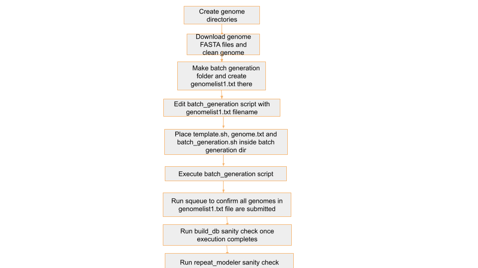

## Step 1 : BuildDatabase and RepeatModeler

Create genome-specific folders under the appropriate directory:

- Use `/shared/input_genomes/paratus-bat/` for Paratus genomes

- Use `/shared/input_genomes/bat1k-bat/` for Bat1K genomes

**Download each genome FASTA file into a directory named after the genome filename (without the .fasta.gz extension). For example:**

- `mHarHar1.hap1.cur.20250102.fasta.gz` → directory: `mHarHar1.hap1.cur.20250102`

- `mHipRub1.HiC.hap1.20240409.fasta.gz` → directory: `mHipRub1.HiC.hap1.20240409`

We keep all the input and outputs of all steps in this directory

Refer **Step 0** for cleaning of downloaded genome fasta files 

# 🔄 Automating BuildDatabase and RepeatModeler Job Submission for Multiple Genomes:

To streamline the process of running BuildDatabase and RepeatModeler  for multiple genomes, we use a loop that:

1. Reads genome names from a text file (genomelist1.txt)

2. Replaces a placeholder xxxx in a job template file (template1.txt) with the actual genome name

3. Submits the customised job file using sbatch

## 📁 Required Input File: genomelist1.txt

This file contains a list of genome names. If there's a header row, we skip it using `tail -n +2`

Example contents:

```
genome_name
mMyoTri1.hap1.decontam
mNatMex1.HiC.hap1
mNycThe2.HiC.hap1.decontam
```
Note: The genome names `genomelist1.txt` in  should match the directory names in `/shared/input_genomes/paratus-bat/` and `/shared/input_genomes/bat1k-bat/` for Paratus and Bat1k respectively

## 📝 Job Template: template1.txt

This is your Slurm job script template. Wherever the text xxxx appears, it will be replaced with the genome name.
template script: 

```
#!/bin/bash
#SBATCH --job-name=xxxx
#SBATCH --output=/shared/slurm-out/xxxx_log_%j.txt
#SBATCH --error=/shared/slurm-out/xxxx_error_%j.txt
#SBATCH --nodes=1
#SBATCH --ntasks=1
#SBATCH --cpus-per-task=72
#SBATCH --constraint=c5.18xlarge
#SBATCH --time=72:00:00
#SBATCH --chdir=/shared/input_genomes/bat1k-bat/xxxx

#mkdir -p /shared/slurm-out
#chmod 777 /shared/slurm-out

echo "Running on HPC"
echo "Job started at: $(date)"
echo "Running on: $(hostname)"
echo "Working dir: $(pwd)"
echo "Listing contents:"
ls -lh

echo "Starting RepeatModeler denovo Reapeat Library..."

#gunzip xxxx.fa.gz
input_fa="xxxx_filtered.fa"
renamed_fa="xxxx_renamed.fa"
db_name="xxxx"


awk '/^>/ {header="scaffold" sprintf("%02d", ++i); $0=">" header; } 1' $input_fa > $renamed_fa

/shared/masking_genomes/RepeatModeler/BuildDatabase -name $db_name $renamed_fa

time /shared/masking_genomes/RepeatModeler/RepeatModeler -threads 72 -database $db_name -engine ncbi 

echo "Job completed with exit code $?"
```

## 🚀 Script to Generate and Submit Jobs
batch_generation.sh

```
#!/bin/bash

# Read the header and skip it
tail -n +2 genomelist1.txt | while IFS=, read genome; do
    # Replace 'xxxx' in template1.txt with $genome
    sed "s/xxxx/$genome/g" template1.txt > "${genome}_job.txt"
    sbatch "${genome}_job.txt"
done
```

## 🔍 Explanation

- The `tail -n +2` skips the first line (header) in the genome list.

- `while IFS=, read genome` reads each genome name, one at a time.

- `sed "s/xxxx/$genome/g"` replaces every instance of xxxx in template1.txt with the actual genome name.

- The output is saved to a new job file (e.g., `mMyoTri1_job.txt`).

- `sbatch` is then used to submit that job file to the Slurm scheduler.

## ▶️ How to Run:

- Create a directory inside `/shared/el-scripts/` 

- Add the following files to the directory:

  - `genomelist1.txt` (containing 20–30 genomes)

  - `template.sh`

  - `batch_generation.sh`

- Run the script using: `./batch_generation.sh`

## 🧾 Example Output

Before running `batch_generation.sh`


After running `batch_generation.sh`


For genome `mMyoTri1`, this command creates:

- `mMyoTri1_job.txt` with:

```
#!/bin/bash
#SBATCH --job-name=mMyoTri1.hap1.decontam
#SBATCH --output=/shared/slurm-out/repeat_modeler_log_err/mMyoTri1.hap1.decontam_log_%j.txt
#SBATCH --error=/shared/slurm-out/repeat_modeler_log_err/mMyoTri1.hap1.decontam_error_%j.txt
#SBATCH --nodes=1
#SBATCH --ntasks=1
#SBATCH --cpus-per-task=72
#SBATCH --constraint=c5.18xlarge
#SBATCH --time=72:00:00
#SBATCH --chdir=/shared/input_genomes/paratus-bat/mMyoTri1.hap1.decontam

#mkdir -p /shared/slurm-out
#chmod 777 /shared/slurm-out

echo "Running on HPC"
echo "Job started at: $(date)"
echo "Running on: $(hostname)"
echo "Working dir: $(pwd)"
echo "Listing contents:"
ls -lh

echo "Starting RepeatModeler denovo Reapeat Library..."

#gunzip mMyoTri1.hap1.decontam.fa.gz
input_fa="mMyoTri1.hap1.decontam_filtered.fa"
renamed_fa="mMyoTri1.hap1.decontam_renamed.fa"
db_name="mMyoTri1.hap1.decontam"


awk '/^>/ {header="scaffold" sprintf("%02d", ++i); $0=">" header; } 1' $input_fa > $renamed_fa

/shared/masking_genomes/RepeatModeler/BuildDatabase -name $db_name $renamed_fa

time /shared/masking_genomes/RepeatModeler/RepeatModeler -threads 72 -database $db_name -engine ncbi 

echo "Job completed with exit code $?"

```

- `--output` log file:
```
#SBATCH --output=/shared/slurm-out/repeat_modeler_log_err/mMyoTri1.hap1.decontam_log_%j.txt
```

- `--error` error file (usually error file has all the logs):

```
#SBATCH --error=/shared/slurm-out/repeat_modeler_log_err/mMyoTri1.hap1.decontam_error_%j.txt
```

- `--chdir` Sets the working directory ($PWD) to the folder containing the filtered genome FASTA file for a specific genome
```
#SBATCH --chdir=/shared/input_genomes/paratus-bat/mMyoTri1.hap1.decontam
```

`input_fa` sets the name of the pre-filtered genome FASTA file to be used

`renamed_fa` will store a renamed version of the input

`db_name` sets the name of the RepeatModeler database

- **Rename FASTA Headers** : `awk` command is used to rename the FASTA headers in a file (specifically, the > lines), replacing each sequence header with a standardised name like `>scaffold01`, `>scaffold02`
```
awk '/^>/ {header="scaffold" sprintf("%02d", ++i); $0=">" header; } 1' $input_fa > $renamed_fa
```

- ***Build RepeatModeler Database***
```
/shared/masking_genomes/RepeatModeler/BuildDatabase -name $db_name $renamed_fa
```
  - Creates a BLAST database that RepeatModeler will use to search for repetitive elements.

  - `-name "$db_name"`: Sets the base name of the database files.

  - `"$renamed_fa"`: The input FASTA file.

  - Output files will include: .nhr, .nin, .njs, .nnd, .nni, .nog, .nsq files

- ***Run RepeatModeler***
```
time /shared/masking_genomes/RepeatModeler/RepeatModeler -threads 72 -database $db_name  -engine ncbi
```
  - `"$db_name"`: Uses the database you just built
  - `-pa 72`: Parallel execution with 72 threads (make sure to match --cpus-per-task=72 in your SBATCH header)

## ⏱️ Duration
- Each genome job would take approximately 21hrs to complete

## 🔍 Sanity Checks Overview
Place the sanity check scripts in the corresponding directories based on the genome type:

- For Paratus genomes, place the scripts in `/shared/input_genomes/paratus-bat/`

- For Bat1K genomes, place the scripts in `/shared/input_genomes/bat1k-bat/`

## 🧪 BuildDatabase Sanity Checks
build_db_check.sh
```
#!/bin/bash
# List of required suffixes
required_suffixes=(.nhr .nin .njs .nnd .nni .nog .nsq)
# Output report file
report_file="build_database_check_report.tsv"
echo -e "genome_dir\tmissing_suffixes" > "$report_file"
# Loop through all top-level subdirectories
for genome_dir in */; do
    genome_name=$(basename "$genome_dir")
    echo "🔍 Checking $genome_name"
    missing=()
    for suffix in "${required_suffixes[@]}"; do
        # Check if any file with the given suffix exists in the current top-level dir
        if ! compgen -G "${genome_dir}*${suffix}" > /dev/null; then
            missing+=("$suffix")
        fi
    done
    if [ ${#missing[@]} -eq 0 ]; then
        echo "✅ All required Build-Database output files found in $genome_name"
        missing_summary="None"
    else
        echo "❌ Missing these Build-Database output files from $genome_name: ${missing[*]}"
        missing_summary=$(IFS=,; echo "${missing[*]}")
    fi
    echo -e "${genome_name}\t${missing_summary}" >> "$report_file"
    echo ""
done
echo "✅ Report written to: $report_file"
```

## ✅ What It Does:
- Iterates over each genome folder inside a specified directory.

- Checks for the presence of required output files based on their suffixes (e.g., .nhr, .nin, .nsq)

- Captures the list of missing files 

- Compiles the check results into a .tsv file.

## 🧾 Output .tsv File:
The script creates a tab-separated summary file with the following columns:

<div style="overflow-x: auto;">

| genome_dir                | missing_files                |
|---------------------------|-----------------------------|
| mAetAle1.hap1.cur.20250328| .nhr, .nin, .njs, .nnd, .nni, .nog, .nsq |
| mAntDub1_hap1.cur.20250116| None                        |

</div>

- Sanity_check_pass column was added manually after inspecting each row

## ▶️ How to Run:
From within the parent genome directory(/shared/input_genomes/paratus-bat/ or /shared/input_genomes/bat1k-bat/ ) :
`./build_db_check.sh`
 

## 🧪 RepeatModeler Sanity Checks
repeat_modeler_check_v4.sh
```
#!/bin/bash
# Root directory containing genome folders
genomes_root="/shared/input_genomes/paratus-bat"  # ← CHANGE THIS
report_file="repeatmodeler_report.tsv"
# Required output files from RepeatModeler
required_rmod_files=("consensi.fa" "families.stk" "rmod.log")
# Write header to report file
echo -e "genome_name\tRepeatModeler_output_found\tconsensi.fa_found\tconsensi.fa_size_kb\tfamilies.stk_found\trmod.log_found\tmissing_files\tchromosomes_in_stk" > "$report_file"
echo "🔎 Scanning RepeatModeler outputs under: $genomes_root"
echo "======================================================="
# Loop through each genome directory
for genome_dir in "$genomes_root"/*/; do
    genome_name=$(basename "$genome_dir")
    rmod_dir="${genome_dir}/RepeatModeler_output"
    missing=()
    output_found="Yes"
    consensi_found="No"
    stk_found="No"
    log_found="No"
    consensi_size="NA"
    chromosome_check="NA"
    echo "📂 Checking genome: $genome_name"
    # Check if RepeatModeler_output exists
    if [[ ! -d "$rmod_dir" ]]; then
        echo "❌ Missing RepeatModeler_output directory in $genome_name"
        output_found="No"
        echo -e "${genome_name}\t${output_found}\t${consensi_found}\t${consensi_size}\t${stk_found}\t${log_found}\tRepeatModeler_output_missing\t${chromosome_check}" >> "$report_file"
        echo ""
        continue
    fi
    echo "✅ Found RepeatModeler_output directory"
    # Check individual required files
    for file in "${required_rmod_files[@]}"; do
        path="$rmod_dir/$file"
        if [[ ! -f "$path" ]]; then
            missing+=("$file")
        else
            case "$file" in
                "consensi.fa")
                    consensi_found="Yes"
                    size_kb=$(du -k "$path" | cut -f1)
                    consensi_size="$size_kb"
                    if (( size_kb < 500 || size_kb > 1200 )); then
                        echo "⚠️ consensi.fa size is outside expected range (500–1200 KB): ${size_kb} KB"
                    else
                        echo "📏 consensi.fa size OK: ${size_kb} KB"
                    fi
                    ;;
                "families.stk")
                    stk_found="Yes"
                    ;;
                "rmod.log")
                    log_found="Yes"
                    ;;
            esac
        fi
    done
    # Compare genome_renamed.fa chromosomes vs families.stk entries
    renamed_fa="${genome_dir}/${genome_name}_renamed.fa"
    if [[ -f "$renamed_fa" && -f "$rmod_dir/families.stk" ]]; then
        # Extract chromosomes from the renamed.fa file
        chromosomes=$(grep "^>" "$renamed_fa" | sed 's/^>//' | cut -d' ' -f1 | sort)
        # Extract headers from families.stk without ">"
        stk_headers=$(grep -v "^#" "$rmod_dir/families.stk" |  cut -d':' -f1 | sort -u)
        missing_chroms=()
        while read -r chrom; do
            if ! grep -q "^$chrom$" <<< "$stk_headers"; then
                missing_chroms+=("$chrom")
            fi
        done <<< "$chromosomes"
        if [[ ${#missing_chroms[@]} -eq 0 ]]; then
            chromosome_check="All_present"
        else
            chromosome_check=$(IFS=,; echo "Missing:${missing_chroms[*]}")
        fi
    fi
    # Log status
    if [[ ${#missing[@]} -eq 0 ]]; then
        echo "✅ All required RepeatModeler files found."
        missing_summary="None"
    else
        echo "❌ Missing files:"
        missing_summary=$(IFS=,; echo "${missing[*]}")
        for f in "${missing[@]}"; do
            echo "   - $f"
        done
    fi
    # Write TSV line
    echo -e "${genome_name}\t${output_found}\t${consensi_found}\t${consensi_size}\t${stk_found}\t${log_found}\t${missing_summary}\t${chromosome_check}" >> "$report_file"
    echo ""
done
echo "✅ Summary report written to: $report_file"
```

## ✅ What It Does:
- Iterates through each genome directory under a given parent folder.

- For each genome, checks if the RepeatModeler_output directory exists.

- If present, verifies the existence of the following files inside it:

  - consensi.fa

  - families.stk

  - rmod.log

- Validates consensi.fa file size to ensure it falls within 500–1200 KB.

- Extracts chromosome names from the input FASTA file and sequence headers from families.stk, then compares them to confirm all chromosomes are represented in families.stk.

- Records missing files, size issues, and chromosome mismatches in a .tsv summary report.

## 🧾 Output .tsv File:
The script creates a tab-separated summary file with the following columns:
<div style="overflow-x: auto;">

| genome_name               | Sanity_check_pass | RepeatModeler_output_found | consensi.fa_found | consensi.fa_size_kb | families.stk_found | rmod.log_found | missing_files | missing_chromosomes_in_stk              |
|---------------------------|-------------------|----------------------------|-------------------|---------------------|--------------------|----------------|---------------|-----------------------------------------|
| mAetAle1.hap1.cur.20250328| Yes               | Yes                        | Yes               | 992                 | Yes                | Yes            | None          | Missing: scaffold24, scaffold28         |
| mAntDub1_hap1.cur.20250116| Yes               | Yes                        | Yes               | 924                 | Yes                | Yes            | None          | Missing: scaffold1000, scaffold1001     |
</div>

Sanity_check_pass column was added manually after inspecting each row checks

🔁 Workflow Overview for BuildDatabase and RepeatModeler


 
