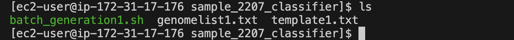
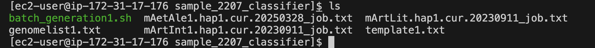

# Gene Loss Detection Pipeline

## Introduction
This pipeline is designed to identify orthologous genes and detect gene loss in a given set of genomes, starting from soft-masked FASTA files. It consists of three modular parts, each handling a distinct stage of the workflow:

### 1. Prepare Genomes
- Build repeat libraries.
- Soft-mask the genome.

### 2. Make LASTZ Chains
- Align masked genomes to the human reference genome (**hg38**).
- Generate alignment chains.

### 3. TOGA
- Use the alignment chains and human annotation to identify orthologous genes.
- Classify the gene status.

## Pipeline Breakdown

### Step 0: Genome Download and Cleaning
- Download raw genome assemblies.
- Clean and preprocess genomes for downstream analysis.

---

### Part 1: Prepare Genomes
**Step 1:** `BuildDatabase` and `RepeatModeler`  
**Step 2:** `RepeatClassifier`  
**Step 3:** `RepeatMasker`  

---

### Part 2: Make LASTZ Chains
**Step 4:** `Make_lastz_chains`  
- Align masked genomes to the human reference genome (**hg38**).  
- Generate alignment chains.

---

### Part 3: TOGA
**Step 5:** `TOGA`  
- Use the alignment chains and human annotation to identify orthologous genes.  
- Classify gene status.

---

## Repository Links

- **Genome Cleaning Scripts:**  
  [https://github.com/paratusbio/Positive-selection/tree/el-scripts/GENE_LOSS/Genome_Cleaning](https://github.com/paratusbio/Positive-selection/tree/el-scripts/GENE_LOSS/Genome_Cleaning)  

- **Batch Generation Scripts for Each Step:**  
  [https://github.com/paratusbio/Positive-selection/tree/el-scripts/GENE_LOSS](https://github.com/paratusbio/Positive-selection/tree/el-scripts/GENE_LOSS)  

- **Sanity Check Scripts for Each Step:**  
  [https://github.com/paratusbio/Positive-selection/tree/el-scripts/GENE_LOSS/Sanity_checks](https://github.com/paratusbio/Positive-selection/tree/el-scripts/GENE_LOSS/Sanity_checks)  

---


## Step 0: Genome Download and Cleaning
🔄 **Manually Downloading and Scoping Multiple Genomes for Unwanted Chromosomes**  
- Genomes are downloaded from the **S3 path** provided by Paratus using the `aws s3 cp` command.  
- Downloaded genomes are arranged in a **predetermined directory structure** (explained in detail in Step 1).  
- Unwanted chromosomes are filtered out during this step.  
- Genomes are **unzipped** before the next step begins.
```
sudo mkdir -p /shared/input_genomes/paratus-bat/mAetAle1.hap1.cur.20250328/
sudo chmod 777 /shared/input_genomes/paratus-bat/mAetAle1.hap1.cur.20250328/
aws s3 cp s3://paratus-ven-elucidata-collab/positive_selection/input_genomes/paratus-bat/mAetAle1.hap1.cur.20250328.fasta.gz /shared/input_genomes/paratus-bat/mAetAle1.hap1.cur.20250328/mAetAle1.hap1.cur.20250328.fa.gz
sudo chmod 777 /shared/input_genomes/paratus-bat/mAetAle1.hap1.cur.20250328/mAetAle1.hap1.cur.20250328.fa.gz
gunzip -c /shared/input_genomes/paratus-bat/mAetAle1.hap1.cur.20250328/mAetAle1.hap1.cur.20250328.fa.gz > /shared/input_genomes/paratus-bat/mAetAle1.hap1.cur.20250328/mAetAle1.hap1.cur.20250328.fa
```
Once the genomes are downloaded and unzipped they are screened for presence of unwanted chromosomes (defined by Paratus ie. X, Y, MT, Z chromosomes ). 
```
echo "/shared/input_genomes/paratus-bat/mAetAle1.hap1.cur.20250328/mAetAle1.hap1.cur.20250328.fa" >> chromname_checking_0305.txt
grep ">" /shared/input_genomes/paratus-bat/mAetAle1.hap1.cur.20250328/mAetAle1.hap1.cur.20250328.fa | grep -i -e "M" -e "X" -e "Y" -e "Z" >> chromname_checking_0305.txt
```
Once screened the output (chromname_checking_0305.txt here) is manually checked for presence of any chromosome present in the genomes.

🔄 **Automating Unwanted chromosomes removal for Multiple Genomes**
- To streamline the process of Unwanted chromosomes removal for multiple genomes, we use a loop that:

## Genome Cleaning Process

- **Reads chromosome names** from a text file `chromosomes_to_removev3.txt`

- **Reads genome names** absolute file paths of FASTA files from `genomev3.txt`

- **Removes the chromosomes from genomes** using the custom script `genome_cleaner.sh`


## 📁 Required Input File: `chromosomes_to_removev3.txt` 

This file contains a list of chromosomes names. They are fetched from file chromname_checking_0305.txt after manual checks.

Example contents:
```
SUPER_X
SUPER_Y
SUPER_X_unloc_1
SUPER_Y_unloc_2
SUPER_X_unloc_4
SUPER_X_unloc_3
SUPER_X_unloc_5
SUPER_Y_unloc_1
SUPER_X_unloc_2
SUPER_X
```

## 📁 Required Input File: `genomev3.txt`

This file contains a list of `genome` fasta files absolute paths. They are also fetched from file `chromname_checking_0305.txt` after manual checks.

Example contents:
```
/shared/input_genomes/paratus-bat/mAetAle1.hap1.cur.20250328/mAetAle1.hap1.cur.20250328.fa
/shared/input_genomes/paratus-bat/mArtInt1.hap1.cur.20230911/mArtInt1.hap1.cur.20230911.fa
/shared/input_genomes/paratus-bat/mArtLit.hap1.cur.20230911/mArtLit.hap1.cur.20230911.fa
/shared/input_genomes/paratus-bat/mAseTrd1.HiC.hap1.20240423/mAseTrd1.HiC.hap1.20240423.fa
/shared/input_genomes/paratus-bat/mAntDub1_hap1.cur.20250116/mAntDub1_hap1.cur.20250116.fa
/shared/input_genomes/paratus-bat/mBraNan1.HiC.hap1.decontam.20240328/mBraNan1.HiC.hap1.decontam.20240328.fa
```

## 🚀 Script to remove the chromosomes from genomes
genome_cleaner.sh

```
#!/bin/bash

# Input lists
genome_list="genomev3.txt"
chromosome_list="chromosomes_to_removev3.txt"

# Build the regex pattern from chromosomes
chrom_pattern=$(paste -sd'|' "$chromosome_list")

# Loop through all genomes
while read -r genome; do
    echo "Processing $genome..."

    output_fasta="${genome%.fa}_filtered.fa"
    log_file="${genome%.fa}_removed_chromosomes.log"

    # Reset log
    > "$log_file"

    awk -v pattern="$chrom_pattern" -v logfile="$log_file" '
    BEGIN { remove = 0 }
    /^>/ {
        if ($0 ~ "^>(" pattern ")") {
            print substr($0,2) >> logfile  # log the chromosome name without ">"
            remove = 1
        } else {
            remove = 0
        }
    }
    remove == 0
    ' "$genome" > "$output_fasta"

    echo "Saved filtered genome to $output_fasta"
    echo "Removed chromosomes logged to $log_file"
done < "$genome_list"
```

## 🔍 Explanation

- Reads a list of genome FASTA files (genomev3.txt) and chromosomes to remove (chromosomes_to_removev3.txt)

- Builds a regex pattern from chromosome names for matching headers

- For each genome file, removes sequences whose headers match the pattern

- Saves the filtered genome to *_filtered.fa and logs removed headers to *_removed_chromosomes.log

## ▶️ How to Run

- Create a directory inside `/shared/el-scripts/`

- Add your genome filenames to `genomev3.txt` (one per line)

- Add unwanted chromosome names to `chromosomes_to_removev3.txt`

- Make script executable: `chmod +x genome_cleaner.sh`

- Run: `./genome_cleaner.sh`

- Output FASTAs and logs are saved in their respective directories of those genomes

## Step 1 : BuildDatabase and RepeatModeler

Create genome-specific folders under the appropriate directory:

- Use `/shared/input_genomes/paratus-bat/` for Paratus genomes

- Use `/shared/input_genomes/bat1k-bat/` for Bat1K genomes

**Download each genome FASTA file into a directory named after the genome filename (without the .fasta.gz extension). For example:**

- `mHarHar1.hap1.cur.20250102.fasta.gz` → directory: `mHarHar1.hap1.cur.20250102`

- `mHipRub1.HiC.hap1.20240409.fasta.gz` → directory: `mHipRub1.HiC.hap1.20240409`

We keep all the input and outputs of all steps in this directory

Refer **Step 0** for cleaning of downloaded genome fasta files 

# 🔄 Automating BuildDatabase and RepeatModeler Job Submission for Multiple Genomes:

To streamline the process of running BuildDatabase and RepeatModeler  for multiple genomes, we use a loop that:

1. Reads genome names from a text file (genomelist1.txt)

2. Replaces a placeholder xxxx in a job template file (template1.txt) with the actual genome name

3. Submits the customised job file using sbatch

## 📁 Required Input File: genomelist1.txt

This file contains a list of genome names. If there's a header row, we skip it using `tail -n +2`

Example contents:

```
genome_name
mMyoTri1.hap1.decontam
mNatMex1.HiC.hap1
mNycThe2.HiC.hap1.decontam
```
Note: The genome names `genomelist1.txt` in  should match the directory names in `/shared/input_genomes/paratus-bat/` and `/shared/input_genomes/bat1k-bat/` for Paratus and Bat1k respectively

## 📝 Job Template: template1.txt

This is your Slurm job script template. Wherever the text xxxx appears, it will be replaced with the genome name.
template script: 

```
#!/bin/bash
#SBATCH --job-name=xxxx
#SBATCH --output=/shared/slurm-out/xxxx_log_%j.txt
#SBATCH --error=/shared/slurm-out/xxxx_error_%j.txt
#SBATCH --nodes=1
#SBATCH --ntasks=1
#SBATCH --cpus-per-task=72
#SBATCH --constraint=c5.18xlarge
#SBATCH --time=72:00:00
#SBATCH --chdir=/shared/input_genomes/bat1k-bat/xxxx

#mkdir -p /shared/slurm-out
#chmod 777 /shared/slurm-out

echo "Running on HPC"
echo "Job started at: $(date)"
echo "Running on: $(hostname)"
echo "Working dir: $(pwd)"
echo "Listing contents:"
ls -lh

echo "Starting RepeatModeler denovo Reapeat Library..."

#gunzip xxxx.fa.gz
input_fa="xxxx_filtered.fa"
renamed_fa="xxxx_renamed.fa"
db_name="xxxx"


awk '/^>/ {header="scaffold" sprintf("%02d", ++i); $0=">" header; } 1' $input_fa > $renamed_fa

/shared/masking_genomes/RepeatModeler/BuildDatabase -name $db_name $renamed_fa

time /shared/masking_genomes/RepeatModeler/RepeatModeler -threads 72 -database $db_name -engine ncbi 

echo "Job completed with exit code $?"
```

## 🚀 Script to Generate and Submit Jobs
batch_generation.sh

```
#!/bin/bash

# Read the header and skip it
tail -n +2 genomelist1.txt | while IFS=, read genome; do
    # Replace 'xxxx' in template1.txt with $genome
    sed "s/xxxx/$genome/g" template1.txt > "${genome}_job.txt"
    sbatch "${genome}_job.txt"
done
```

## 🔍 Explanation

- The `tail -n +2` skips the first line (header) in the genome list.

- `while IFS=, read genome` reads each genome name, one at a time.

- `sed "s/xxxx/$genome/g"` replaces every instance of xxxx in template1.txt with the actual genome name.

- The output is saved to a new job file (e.g., `mMyoTri1_job.txt`).

- `sbatch` is then used to submit that job file to the Slurm scheduler.

## ▶️ How to Run:

- Create a directory inside `/shared/el-scripts/` 

- Add the following files to the directory:

  - `genomelist1.txt` (containing 20–30 genomes)

  - `template.sh`

  - `batch_generation.sh`

- Run the script using: `./batch_generation.sh`

## 🧾 Example Output

Before running `batch_generation.sh`


After running `batch_generation.sh`

