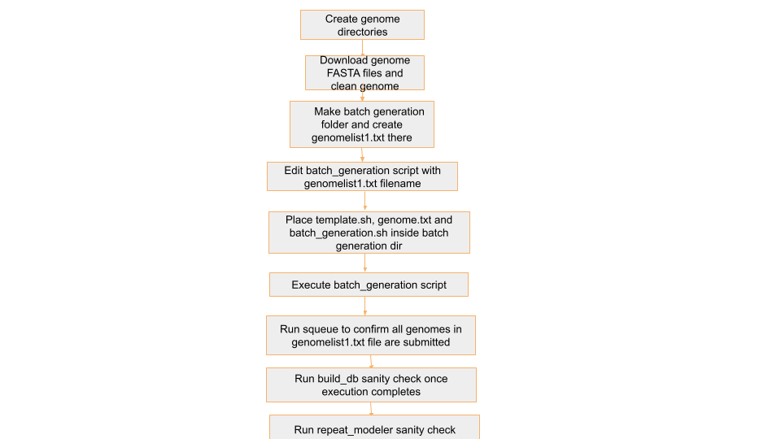

# Gene Loss Detection Pipeline

## Introduction
This pipeline is designed to identify orthologous genes and detect gene loss in a given set of genomes, starting from soft-masked FASTA files. It consists of three modular parts, each handling a distinct stage of the workflow:

### 1. Prepare Genomes
- Build repeat libraries.
- Soft-mask the genome.

### 2. Make LASTZ Chains
- Align masked genomes to the human reference genome (**hg38**).
- Generate alignment chains.

### 3. TOGA
- Use the alignment chains and human annotation to identify orthologous genes.
- Classify the gene status.

## Pipeline Breakdown

### Step 0: Genome Download and Cleaning
- Download raw genome assemblies.
- Clean and preprocess genomes for downstream analysis.

---

### Part 1: Prepare Genomes
**Step 1:** `BuildDatabase` and `RepeatModeler`  
**Step 2:** `RepeatClassifier`  
**Step 3:** `RepeatMasker`  

---

### Part 2: Make LASTZ Chains
**Step 4:** `Make_lastz_chains`  
- Align masked genomes to the human reference genome (**hg38**).  
- Generate alignment chains.

---

### Part 3: TOGA
**Step 5:** `TOGA`  
- Use the alignment chains and human annotation to identify orthologous genes.  
- Classify gene status.

---

## Repository Links

- **Genome Cleaning Scripts:**  
  [https://github.com/paratusbio/Positive-selection/tree/el-scripts/GENE_LOSS/Genome_Cleaning](https://github.com/paratusbio/Positive-selection/tree/el-scripts/GENE_LOSS/Genome_Cleaning)  

- **Batch Generation Scripts for Each Step:**  
  [https://github.com/paratusbio/Positive-selection/tree/el-scripts/GENE_LOSS](https://github.com/paratusbio/Positive-selection/tree/el-scripts/GENE_LOSS)  

- **Sanity Check Scripts for Each Step:**  
  [https://github.com/paratusbio/Positive-selection/tree/el-scripts/GENE_LOSS/Sanity_checks](https://github.com/paratusbio/Positive-selection/tree/el-scripts/GENE_LOSS/Sanity_checks)  

---


## Step 0: Genome Download and Cleaning
🔄 **Manually Downloading and Scoping Multiple Genomes for Unwanted Chromosomes**  
- Genomes are downloaded from the **S3 path** provided by Paratus using the `aws s3 cp` command.  
- Downloaded genomes are arranged in a **predetermined directory structure** (explained in detail in Step 1).  
- Unwanted chromosomes are filtered out during this step.  
- Genomes are **unzipped** before the next step begins.
```
sudo mkdir -p /shared/input_genomes/paratus-bat/mAetAle1.hap1.cur.20250328/
sudo chmod 777 /shared/input_genomes/paratus-bat/mAetAle1.hap1.cur.20250328/
aws s3 cp s3://paratus-ven-elucidata-collab/positive_selection/input_genomes/paratus-bat/mAetAle1.hap1.cur.20250328.fasta.gz /shared/input_genomes/paratus-bat/mAetAle1.hap1.cur.20250328/mAetAle1.hap1.cur.20250328.fa.gz
sudo chmod 777 /shared/input_genomes/paratus-bat/mAetAle1.hap1.cur.20250328/mAetAle1.hap1.cur.20250328.fa.gz
gunzip -c /shared/input_genomes/paratus-bat/mAetAle1.hap1.cur.20250328/mAetAle1.hap1.cur.20250328.fa.gz > /shared/input_genomes/paratus-bat/mAetAle1.hap1.cur.20250328/mAetAle1.hap1.cur.20250328.fa
```
Once the genomes are downloaded and unzipped they are screened for presence of unwanted chromosomes (defined by Paratus ie. X, Y, MT, Z chromosomes ). 
```
echo "/shared/input_genomes/paratus-bat/mAetAle1.hap1.cur.20250328/mAetAle1.hap1.cur.20250328.fa" >> chromname_checking_0305.txt
grep ">" /shared/input_genomes/paratus-bat/mAetAle1.hap1.cur.20250328/mAetAle1.hap1.cur.20250328.fa | grep -i -e "M" -e "X" -e "Y" -e "Z" >> chromname_checking_0305.txt
```
Once screened the output (chromname_checking_0305.txt here) is manually checked for presence of any chromosome present in the genomes.

🔄 **Automating Unwanted chromosomes removal for Multiple Genomes**
- To streamline the process of Unwanted chromosomes removal for multiple genomes, we use a loop that:

## Genome Cleaning Process

- **Reads chromosome names** from a text file `chromosomes_to_removev3.txt`

- **Reads genome names** absolute file paths of FASTA files from `genomev3.txt`

- **Removes the chromosomes from genomes** using the custom script `genome_cleaner.sh`


## 📁 Required Input File: `chromosomes_to_removev3.txt` 

This file contains a list of chromosomes names. They are fetched from file chromname_checking_0305.txt after manual checks.

Example contents:
```
SUPER_X
SUPER_Y
SUPER_X_unloc_1
SUPER_Y_unloc_2
SUPER_X_unloc_4
SUPER_X_unloc_3
SUPER_X_unloc_5
SUPER_Y_unloc_1
SUPER_X_unloc_2
SUPER_X
```

## 📁 Required Input File: `genomev3.txt`

This file contains a list of `genome` fasta files absolute paths. They are also fetched from file `chromname_checking_0305.txt` after manual checks.

Example contents:
```
/shared/input_genomes/paratus-bat/mAetAle1.hap1.cur.20250328/mAetAle1.hap1.cur.20250328.fa
/shared/input_genomes/paratus-bat/mArtInt1.hap1.cur.20230911/mArtInt1.hap1.cur.20230911.fa
/shared/input_genomes/paratus-bat/mArtLit.hap1.cur.20230911/mArtLit.hap1.cur.20230911.fa
/shared/input_genomes/paratus-bat/mAseTrd1.HiC.hap1.20240423/mAseTrd1.HiC.hap1.20240423.fa
/shared/input_genomes/paratus-bat/mAntDub1_hap1.cur.20250116/mAntDub1_hap1.cur.20250116.fa
/shared/input_genomes/paratus-bat/mBraNan1.HiC.hap1.decontam.20240328/mBraNan1.HiC.hap1.decontam.20240328.fa
```

## 🚀 Script to remove the chromosomes from genomes
genome_cleaner.sh

```
#!/bin/bash

# Input lists
genome_list="genomev3.txt"
chromosome_list="chromosomes_to_removev3.txt"

# Build the regex pattern from chromosomes
chrom_pattern=$(paste -sd'|' "$chromosome_list")

# Loop through all genomes
while read -r genome; do
    echo "Processing $genome..."

    output_fasta="${genome%.fa}_filtered.fa"
    log_file="${genome%.fa}_removed_chromosomes.log"

    # Reset log
    > "$log_file"

    awk -v pattern="$chrom_pattern" -v logfile="$log_file" '
    BEGIN { remove = 0 }
    /^>/ {
        if ($0 ~ "^>(" pattern ")") {
            print substr($0,2) >> logfile  # log the chromosome name without ">"
            remove = 1
        } else {
            remove = 0
        }
    }
    remove == 0
    ' "$genome" > "$output_fasta"

    echo "Saved filtered genome to $output_fasta"
    echo "Removed chromosomes logged to $log_file"
done < "$genome_list"
```

## 🔍 Explanation

- Reads a list of genome FASTA files (genomev3.txt) and chromosomes to remove (chromosomes_to_removev3.txt)

- Builds a regex pattern from chromosome names for matching headers

- For each genome file, removes sequences whose headers match the pattern

- Saves the filtered genome to *_filtered.fa and logs removed headers to *_removed_chromosomes.log

## ▶️ How to Run

- Create a directory inside `/shared/el-scripts/`

- Add your genome filenames to `genomev3.txt` (one per line)

- Add unwanted chromosome names to `chromosomes_to_removev3.txt`

- Make script executable: `chmod +x genome_cleaner.sh`

- Run: `./genome_cleaner.sh`

- Output FASTAs and logs are saved in their respective directories of those genomes

## Step 1 : BuildDatabase and RepeatModeler

Create genome-specific folders under the appropriate directory:

- Use `/shared/input_genomes/paratus-bat/` for Paratus genomes

- Use `/shared/input_genomes/bat1k-bat/` for Bat1K genomes

**Download each genome FASTA file into a directory named after the genome filename (without the .fasta.gz extension). For example:**

- `mHarHar1.hap1.cur.20250102.fasta.gz` → directory: `mHarHar1.hap1.cur.20250102`

- `mHipRub1.HiC.hap1.20240409.fasta.gz` → directory: `mHipRub1.HiC.hap1.20240409`

We keep all the input and outputs of all steps in this directory

Refer **Step 0** for cleaning of downloaded genome fasta files 

# 🔄 Automating BuildDatabase and RepeatModeler Job Submission for Multiple Genomes:

To streamline the process of running BuildDatabase and RepeatModeler  for multiple genomes, we use a loop that:

1. Reads genome names from a text file (genomelist1.txt)

2. Replaces a placeholder xxxx in a job template file (template1.txt) with the actual genome name

3. Submits the customised job file using sbatch

## 📁 Required Input File: genomelist1.txt

This file contains a list of genome names. If there's a header row, we skip it using `tail -n +2`

Example contents:

```
genome_name
mMyoTri1.hap1.decontam
mNatMex1.HiC.hap1
mNycThe2.HiC.hap1.decontam
```
Note: The genome names `genomelist1.txt` in  should match the directory names in `/shared/input_genomes/paratus-bat/` and `/shared/input_genomes/bat1k-bat/` for Paratus and Bat1k respectively

## 📝 Job Template: template1.txt

This is your Slurm job script template. Wherever the text xxxx appears, it will be replaced with the genome name.
template script: 

```
#!/bin/bash
#SBATCH --job-name=xxxx
#SBATCH --output=/shared/slurm-out/xxxx_log_%j.txt
#SBATCH --error=/shared/slurm-out/xxxx_error_%j.txt
#SBATCH --nodes=1
#SBATCH --ntasks=1
#SBATCH --cpus-per-task=72
#SBATCH --constraint=c5.18xlarge
#SBATCH --time=72:00:00
#SBATCH --chdir=/shared/input_genomes/bat1k-bat/xxxx

#mkdir -p /shared/slurm-out
#chmod 777 /shared/slurm-out

echo "Running on HPC"
echo "Job started at: $(date)"
echo "Running on: $(hostname)"
echo "Working dir: $(pwd)"
echo "Listing contents:"
ls -lh

echo "Starting RepeatModeler denovo Reapeat Library..."

#gunzip xxxx.fa.gz
input_fa="xxxx_filtered.fa"
renamed_fa="xxxx_renamed.fa"
db_name="xxxx"


awk '/^>/ {header="scaffold" sprintf("%02d", ++i); $0=">" header; } 1' $input_fa > $renamed_fa

/shared/masking_genomes/RepeatModeler/BuildDatabase -name $db_name $renamed_fa

time /shared/masking_genomes/RepeatModeler/RepeatModeler -threads 72 -database $db_name -engine ncbi 

echo "Job completed with exit code $?"
```

## 🚀 Script to Generate and Submit Jobs
batch_generation.sh

```
#!/bin/bash

# Read the header and skip it
tail -n +2 genomelist1.txt | while IFS=, read genome; do
    # Replace 'xxxx' in template1.txt with $genome
    sed "s/xxxx/$genome/g" template1.txt > "${genome}_job.txt"
    sbatch "${genome}_job.txt"
done
```

## 🔍 Explanation

- The `tail -n +2` skips the first line (header) in the genome list.

- `while IFS=, read genome` reads each genome name, one at a time.

- `sed "s/xxxx/$genome/g"` replaces every instance of xxxx in template1.txt with the actual genome name.

- The output is saved to a new job file (e.g., `mMyoTri1_job.txt`).

- `sbatch` is then used to submit that job file to the Slurm scheduler.

## ▶️ How to Run:

- Create a directory inside `/shared/el-scripts/` 

- Add the following files to the directory:

  - `genomelist1.txt` (containing 20–30 genomes)

  - `template.sh`

  - `batch_generation.sh`

- Run the script using: `./batch_generation.sh`

## 🧾 Example Output

Before running `batch_generation.sh`


After running `batch_generation.sh`


For genome `mMyoTri1`, this command creates:

- `mMyoTri1_job.txt` with:

```
#!/bin/bash
#SBATCH --job-name=mMyoTri1.hap1.decontam
#SBATCH --output=/shared/slurm-out/repeat_modeler_log_err/mMyoTri1.hap1.decontam_log_%j.txt
#SBATCH --error=/shared/slurm-out/repeat_modeler_log_err/mMyoTri1.hap1.decontam_error_%j.txt
#SBATCH --nodes=1
#SBATCH --ntasks=1
#SBATCH --cpus-per-task=72
#SBATCH --constraint=c5.18xlarge
#SBATCH --time=72:00:00
#SBATCH --chdir=/shared/input_genomes/paratus-bat/mMyoTri1.hap1.decontam

#mkdir -p /shared/slurm-out
#chmod 777 /shared/slurm-out

echo "Running on HPC"
echo "Job started at: $(date)"
echo "Running on: $(hostname)"
echo "Working dir: $(pwd)"
echo "Listing contents:"
ls -lh

echo "Starting RepeatModeler denovo Reapeat Library..."

#gunzip mMyoTri1.hap1.decontam.fa.gz
input_fa="mMyoTri1.hap1.decontam_filtered.fa"
renamed_fa="mMyoTri1.hap1.decontam_renamed.fa"
db_name="mMyoTri1.hap1.decontam"


awk '/^>/ {header="scaffold" sprintf("%02d", ++i); $0=">" header; } 1' $input_fa > $renamed_fa

/shared/masking_genomes/RepeatModeler/BuildDatabase -name $db_name $renamed_fa

time /shared/masking_genomes/RepeatModeler/RepeatModeler -threads 72 -database $db_name -engine ncbi 

echo "Job completed with exit code $?"

```

- `--output` log file:
```
#SBATCH --output=/shared/slurm-out/repeat_modeler_log_err/mMyoTri1.hap1.decontam_log_%j.txt
```

- `--error` error file (usually error file has all the logs):

```
#SBATCH --error=/shared/slurm-out/repeat_modeler_log_err/mMyoTri1.hap1.decontam_error_%j.txt
```

- `--chdir` Sets the working directory ($PWD) to the folder containing the filtered genome FASTA file for a specific genome
```
#SBATCH --chdir=/shared/input_genomes/paratus-bat/mMyoTri1.hap1.decontam
```

`input_fa` sets the name of the pre-filtered genome FASTA file to be used

`renamed_fa` will store a renamed version of the input

`db_name` sets the name of the RepeatModeler database

- **Rename FASTA Headers** : `awk` command is used to rename the FASTA headers in a file (specifically, the > lines), replacing each sequence header with a standardised name like `>scaffold01`, `>scaffold02`
```
awk '/^>/ {header="scaffold" sprintf("%02d", ++i); $0=">" header; } 1' $input_fa > $renamed_fa
```

- ***Build RepeatModeler Database***
```
/shared/masking_genomes/RepeatModeler/BuildDatabase -name $db_name $renamed_fa
```
  - Creates a BLAST database that RepeatModeler will use to search for repetitive elements.

  - `-name "$db_name"`: Sets the base name of the database files.

  - `"$renamed_fa"`: The input FASTA file.

  - Output files will include: .nhr, .nin, .njs, .nnd, .nni, .nog, .nsq files

- ***Run RepeatModeler***
```
time /shared/masking_genomes/RepeatModeler/RepeatModeler -threads 72 -database $db_name  -engine ncbi
```
  - `"$db_name"`: Uses the database you just built
  - `-pa 72`: Parallel execution with 72 threads (make sure to match --cpus-per-task=72 in your SBATCH header)

## ⏱️ Duration
- Each genome job would take approximately 21hrs to complete

## 🔍 Sanity Checks Overview
Place the sanity check scripts in the corresponding directories based on the genome type:

- For Paratus genomes, place the scripts in `/shared/input_genomes/paratus-bat/`

- For Bat1K genomes, place the scripts in `/shared/input_genomes/bat1k-bat/`

## 🧪 BuildDatabase Sanity Checks
build_db_check.sh
```
#!/bin/bash
# List of required suffixes
required_suffixes=(.nhr .nin .njs .nnd .nni .nog .nsq)
# Output report file
report_file="build_database_check_report.tsv"
echo -e "genome_dir\tmissing_suffixes" > "$report_file"
# Loop through all top-level subdirectories
for genome_dir in */; do
    genome_name=$(basename "$genome_dir")
    echo "🔍 Checking $genome_name"
    missing=()
    for suffix in "${required_suffixes[@]}"; do
        # Check if any file with the given suffix exists in the current top-level dir
        if ! compgen -G "${genome_dir}*${suffix}" > /dev/null; then
            missing+=("$suffix")
        fi
    done
    if [ ${#missing[@]} -eq 0 ]; then
        echo "✅ All required Build-Database output files found in $genome_name"
        missing_summary="None"
    else
        echo "❌ Missing these Build-Database output files from $genome_name: ${missing[*]}"
        missing_summary=$(IFS=,; echo "${missing[*]}")
    fi
    echo -e "${genome_name}\t${missing_summary}" >> "$report_file"
    echo ""
done
echo "✅ Report written to: $report_file"
```

## ✅ What It Does:
- Iterates over each genome folder inside a specified directory.

- Checks for the presence of required output files based on their suffixes (e.g., .nhr, .nin, .nsq)

- Captures the list of missing files 

- Compiles the check results into a .tsv file.

## 🧾 Output .tsv File:
The script creates a tab-separated summary file with the following columns:

<div style="overflow-x: auto;">

| genome_dir                | missing_files                |
|---------------------------|-----------------------------|
| mAetAle1.hap1.cur.20250328| .nhr, .nin, .njs, .nnd, .nni, .nog, .nsq |
| mAntDub1_hap1.cur.20250116| None                        |

</div>

- Sanity_check_pass column was added manually after inspecting each row

## ▶️ How to Run:
From within the parent genome directory(/shared/input_genomes/paratus-bat/ or /shared/input_genomes/bat1k-bat/ ) :
`./build_db_check.sh`
 

## 🧪 RepeatModeler Sanity Checks
repeat_modeler_check_v4.sh
```
#!/bin/bash
# Root directory containing genome folders
genomes_root="/shared/input_genomes/paratus-bat"  # ← CHANGE THIS
report_file="repeatmodeler_report.tsv"
# Required output files from RepeatModeler
required_rmod_files=("consensi.fa" "families.stk" "rmod.log")
# Write header to report file
echo -e "genome_name\tRepeatModeler_output_found\tconsensi.fa_found\tconsensi.fa_size_kb\tfamilies.stk_found\trmod.log_found\tmissing_files\tchromosomes_in_stk" > "$report_file"
echo "🔎 Scanning RepeatModeler outputs under: $genomes_root"
echo "======================================================="
# Loop through each genome directory
for genome_dir in "$genomes_root"/*/; do
    genome_name=$(basename "$genome_dir")
    rmod_dir="${genome_dir}/RepeatModeler_output"
    missing=()
    output_found="Yes"
    consensi_found="No"
    stk_found="No"
    log_found="No"
    consensi_size="NA"
    chromosome_check="NA"
    echo "📂 Checking genome: $genome_name"
    # Check if RepeatModeler_output exists
    if [[ ! -d "$rmod_dir" ]]; then
        echo "❌ Missing RepeatModeler_output directory in $genome_name"
        output_found="No"
        echo -e "${genome_name}\t${output_found}\t${consensi_found}\t${consensi_size}\t${stk_found}\t${log_found}\tRepeatModeler_output_missing\t${chromosome_check}" >> "$report_file"
        echo ""
        continue
    fi
    echo "✅ Found RepeatModeler_output directory"
    # Check individual required files
    for file in "${required_rmod_files[@]}"; do
        path="$rmod_dir/$file"
        if [[ ! -f "$path" ]]; then
            missing+=("$file")
        else
            case "$file" in
                "consensi.fa")
                    consensi_found="Yes"
                    size_kb=$(du -k "$path" | cut -f1)
                    consensi_size="$size_kb"
                    if (( size_kb < 500 || size_kb > 1200 )); then
                        echo "⚠️ consensi.fa size is outside expected range (500–1200 KB): ${size_kb} KB"
                    else
                        echo "📏 consensi.fa size OK: ${size_kb} KB"
                    fi
                    ;;
                "families.stk")
                    stk_found="Yes"
                    ;;
                "rmod.log")
                    log_found="Yes"
                    ;;
            esac
        fi
    done
    # Compare genome_renamed.fa chromosomes vs families.stk entries
    renamed_fa="${genome_dir}/${genome_name}_renamed.fa"
    if [[ -f "$renamed_fa" && -f "$rmod_dir/families.stk" ]]; then
        # Extract chromosomes from the renamed.fa file
        chromosomes=$(grep "^>" "$renamed_fa" | sed 's/^>//' | cut -d' ' -f1 | sort)
        # Extract headers from families.stk without ">"
        stk_headers=$(grep -v "^#" "$rmod_dir/families.stk" |  cut -d':' -f1 | sort -u)
        missing_chroms=()
        while read -r chrom; do
            if ! grep -q "^$chrom$" <<< "$stk_headers"; then
                missing_chroms+=("$chrom")
            fi
        done <<< "$chromosomes"
        if [[ ${#missing_chroms[@]} -eq 0 ]]; then
            chromosome_check="All_present"
        else
            chromosome_check=$(IFS=,; echo "Missing:${missing_chroms[*]}")
        fi
    fi
    # Log status
    if [[ ${#missing[@]} -eq 0 ]]; then
        echo "✅ All required RepeatModeler files found."
        missing_summary="None"
    else
        echo "❌ Missing files:"
        missing_summary=$(IFS=,; echo "${missing[*]}")
        for f in "${missing[@]}"; do
            echo "   - $f"
        done
    fi
    # Write TSV line
    echo -e "${genome_name}\t${output_found}\t${consensi_found}\t${consensi_size}\t${stk_found}\t${log_found}\t${missing_summary}\t${chromosome_check}" >> "$report_file"
    echo ""
done
echo "✅ Summary report written to: $report_file"
```

## ✅ What It Does:
- Iterates through each genome directory under a given parent folder.

- For each genome, checks if the RepeatModeler_output directory exists.

- If present, verifies the existence of the following files inside it:

  - consensi.fa

  - families.stk

  - rmod.log

- Validates consensi.fa file size to ensure it falls within 500–1200 KB.

- Extracts chromosome names from the input FASTA file and sequence headers from families.stk, then compares them to confirm all chromosomes are represented in families.stk.

- Records missing files, size issues, and chromosome mismatches in a .tsv summary report.

## 🧾 Output .tsv File:
The script creates a tab-separated summary file with the following columns:
<div style="overflow-x: auto;">

| genome_name               | Sanity_check_pass | RepeatModeler_output_found | consensi.fa_found | consensi.fa_size_kb | families.stk_found | rmod.log_found | missing_files | missing_chromosomes_in_stk              |
|---------------------------|-------------------|----------------------------|-------------------|---------------------|--------------------|----------------|---------------|-----------------------------------------|
| mAetAle1.hap1.cur.20250328| Yes               | Yes                        | Yes               | 992                 | Yes                | Yes            | None          | Missing: scaffold24, scaffold28         |
| mAntDub1_hap1.cur.20250116| Yes               | Yes                        | Yes               | 924                 | Yes                | Yes            | None          | Missing: scaffold1000, scaffold1001     |
</div>

Sanity_check_pass column was added manually after inspecting each row checks

🔁 Workflow Overview for BuildDatabase and RepeatModeler


 

## Step 2 : RepeatClassifier

## 🔄 Automating RepeatClassifier Job Submission for Multiple Genomes
To streamline the process of running BuildDatabase and RepeatModeler  for multiple genomes, we use a loop that:

1.Reads genome names from a text file (`genomelist1.txt`)

2.Replaces a placeholder xxxx in a job template file (`template1.txt`) with the actual genome name

3.Submits the customised job file using sbatch

## 📁 Required Input File: `genomelist1.txt`
This file contains a list of genome names. If there's a header row, we skip it using tail -n +2.

Example contents:
```
genome_name
mMyoTri1.hap1.decontam
mNatMex1.HiC.hap1
mNycThe2.HiC.hap1.decontam
```

Note: The genome names `genomelist1.txt` in  should match the folder names in `/shared/input_genomes/paratus-bat/` and `/shared/input_genomes/bat1k-bat/` for Paratus and Bat1k respectively

## 📝 Job Template: `template1.txt`
This is your Slurm job script template. Wherever the text xxxx appears, it will be replaced with the genome name.

template script:
```
#!/bin/bash
#SBATCH --job-name=xxxx-classifier
#SBATCH --output=/shared/slurm-out/repeat_classifier_log_err/xxxx-classifier-output_job_%j.txt
#SBATCH --error=/shared/slurm-out/repeat_classifier_log_err/xxxx-classifier-error_job_%j.txt
#SBATCH --nodes=1
#SBATCH --ntasks=1
#SBATCH --cpus-per-task=48
#SBATCH --constraint=c5.12xlarge
#SBATCH --time=10:00:00
#SBATCH --chdir=/shared/input_genomes/paratus-bat/xxxx
#mkdir -p /shared/slurm-out
#chmod 777 /shared/slurm-out
echo "Running on HPC"
echo "Job started at: $(date)"
echo "Running on: $(hostname)"
echo "Working dir: $(pwd)"
echo "Listing contents:"
ls -lh
echo "Starting RepeatModeler Classifier..."
# Prevent conda from using user-specific config paths
export CONDA_PKGS_DIRS=/tmp/conda_pkgs_$SLURM_JOB_ID
export CONDA_ENVS_PATH=/tmp/conda_envs_$SLURM_JOB_ID
export HOME=/tmp  # temporary HOME to avoid ~/.condarc issue
export CONDA_NO_PLUGINS=true  # optional, if plugins are breaking it
source /shared/tools/miniconda3/etc/profile.d/conda.sh
conda activate prepare_genomes
# Get the input path
parent_dir="$(pwd)"
# Find first subdirectory (customize `head -n 1` or pattern as needed)
subdir=$(find "$parent_dir" -mindepth 1 -maxdepth 1 -type d | head -n 1)
# Define new name (customize if needed)
new_name="${parent_dir}/RepeatModeler_output"
mv "$subdir" "$new_name"
cd "${new_name}"
time /shared/masking_genomes/RepeatModeler/RepeatClassifier -consensi "${new_name}/consensi.fa" -stockholm "${new_name}/families.stk"
echo "Job completed with exit code $?"
``` 

## 🚀 Script to Generate and Submit Jobs
batch_generation.sh
```
#!/bin/bash
# Read the header and skip it
tail -n +2 genomelist1.txt | while IFS=, read genome; do
    # Replace 'xxxx' in template1.txt with $genome
    sed "s/xxxx/$genome/g" template1.txt > "${genome}_job.txt"
    sbatch "${genome}_job.txt"
done
```

## 🔍 Explanation
- The tail -n +2 skips the first line (header) in the genome list.

- while IFS=, read genome reads each genome name, one at a time.

- sed "s/xxxx/$genome/g" replaces every instance of xxxx in template1.txt with the actual genome name.

- The output is saved to a new job file (e.g., mMyoTri1_job.txt).

- sbatch is then used to submit that job file to the Slurm scheduler.

## ▶️ How to Run:
- make batch generation folder like batch_0503_classifier inside /shared/el-scripts/

- Keep 20-25 genomes in genomelist1.txt

- keep genomelist1.txt, template.sh,batch_generation.sh in this folder

- run ./batch_generation.sh

## 🧾 Example Output
Before running batch_generation.sh


After running batch_generation.sh


For genome mMyoTri1, this command creates:
```
#!/bin/bash
#SBATCH --job-name=mMyoTri1.hap1.decontam-classifier
#SBATCH --output=/shared/slurm-out/repeat_classifier_log_err/mMyoTri1.hap1.decontam-classifier-output_job_%j.txt
#SBATCH --error=/shared/slurm-out/repeat_classifier_log_err/mMyoTri1.hap1.decontam-classifier-error_job_%j.txt
#SBATCH --nodes=1
#SBATCH --ntasks=1
#SBATCH --cpus-per-task=48
#SBATCH --constraint=c5.12xlarge
#SBATCH --time=10:00:00
#SBATCH --chdir=/shared/input_genomes/paratus-bat/mMyoTri1.hap1.decontam
#mkdir -p /shared/slurm-out
#chmod 777 /shared/slurm-out
echo "Running on HPC"
echo "Job started at: $(date)"
echo "Running on: $(hostname)"
echo "Working dir: $(pwd)"
echo "Listing contents:"
ls -lh
echo "Starting RepeatModeler Classifier..."
# Prevent conda from using user-specific config paths
export CONDA_PKGS_DIRS=/tmp/conda_pkgs_$SLURM_JOB_ID
export CONDA_ENVS_PATH=/tmp/conda_envs_$SLURM_JOB_ID
export HOME=/tmp  # temporary HOME to avoid ~/.condarc issue
export CONDA_NO_PLUGINS=true  # optional, if plugins are breaking it
source /shared/tools/miniconda3/etc/profile.d/conda.sh
conda activate prepare_genomes
# Get the input path
parent_dir="$(pwd)"
# Find first subdirectory (customize `head -n 1` or pattern as needed)
subdir=$(find "$parent_dir" -mindepth 1 -maxdepth 1 -type d | head -n 1)
# Define new name (customize if needed)
new_name="${parent_dir}/RepeatModeler_output"
mv "$subdir" "$new_name"
cd "${new_name}"
time /shared/masking_genomes/RepeatModeler/RepeatClassifier -consensi "${new_name}/consensi.fa" -stockholm "${new_name}/families.stk"
echo "Job completed with exit code $?"
```

- `--output` log file:
```
#SBATCH --output=/shared/slurm-out/repeat_classifier_log_err/mMyoTri1.hap1.decontam-classifier-output_job_%j.txt
```

- `--error` error file (usually error file has all the logs):
```
#SBATCH --error=/shared/slurm-out/repeat_classifier_log_err/mMyoTri1.hap1.decontam-classifier-error_job_%j.txt
```

- `--chdir` Sets the working directory ($PWD) to the folder containing the filtered genome FASTA file for a specific genome
```
#SBATCH --chdir=/shared/input_genomes/paratus-bat/mMyoTri1.hap1.decontam
```

- Activate conda env
```
source /shared/tools/miniconda3/etc/profile.d/conda.sh
conda activate prepare_genomes
```

- Find subdir that was generated by the RepeatModeler tool and rename
```
subdir=$(find "$parent_dir" -mindepth 1 -maxdepth 1 -type d | head -n 1)
mv "$subdir" "$new_name"
cd "${new_name}"
```

- RepeatClassifier command
```
time /shared/masking_genomes/RepeatModeler/RepeatClassifier -consensi "${new_name}/consensi.fa" -stockholm "${new_name}/families.stk"
```
`-consensi` : path for consensi file

`-stockholm` : path for stk file

## ⏱️ Duration
Each genome job would take approximately 10minutes to complete

## 🔍 Sanity Checks Overview
Place the sanity check scripts in the corresponding directories based on the genome type:

- For Paratus genomes, place the scripts in /shared/input_genomes/paratus-bat/

- For Bat1K genomes, place the scripts in /shared/input_genomes/bat1k-bat/

🧪 RepeatClassifier Sanity Checks
repeat_classifier_check.sh
```
#!/bin/bash
# Output report file
report_file="consensi_classified_check_report.tsv"
echo -e "genome_dir\tclassified_file_present" > "$report_file"
# Loop through all top-level subdirectories
for genome_dir in */; do
    genome_name=$(basename "$genome_dir")
    rm_output_dir="${genome_dir}/RepeatModeler_output"
    target_file="${rm_output_dir}/consensi.fa.classified"
    echo "🔍 Checking $genome_name"
    if [[ -f "$target_file" ]]; then
        echo "✅ $target_file is present."
        status="present"
    else
        echo "❌ $target_file is missing."
        status="missing"
    fi
    echo -e "${genome_name}\t${status}" >> "$report_file"
    echo ""
done
echo "✅ Report written to: $report_file"
```

## ✅ What It Does:
- Iterates through each genome folder under a specified parent directory.

- Checks if consensi.fa.classified is present in RepeatModeler_output subdir

- Compiles the check results into a .tsv file.

## 🧾 Output .tsv File:
The script creates a tab-separated summary file with the following columns:
<div style="overflow-x: auto;">

| genome_dir                | classified_file_present |
|---------------------------|-------------------------|
| mAetAle1.hap1.cur.20250328| present                 |
</div>

Sanity_check_pass column was added manually after inspecting each row checks

## 🔁 Workflow Overview for RepeatClassifier

Untitled presentation (3).png
 

# Step 3 : RepeatMasker

## 🔄 Automating RepeatMasker Job Submission for Multiple Genomes
To streamline the process of running BuildDatabase and RepeatModeler  for multiple genomes, we use a loop that:

Reads genome names from a text file (genomelist1.txt)

Replaces a placeholder xxxx in a job template file (template1.txt) with the actual genome name

Submits the customised job file using sbatch

## 📁 Required Input File: genomelist1.txt
This file contains a list of genome names. If there's a header row, we skip it using tail -n +2.

Example contents:
```
genome_name
mMyoTri1.hap1.decontam
mNatMex1.HiC.hap1
mNycThe2.HiC.hap1.decontam
```

Note: The genome names genomelist1.txt in  should match the directory names in /shared/input_genomes/paratus-bat/ and /shared/input_genomes/bat1k-bat/ for Paratus and Bat1k respectively

## 📝 Job Template: template1.txt
This is your Slurm job script template. Wherever the text xxxx appears, it will be replaced with the genome name.

template script:
```
#!/bin/bash
#SBATCH --job-name=xxxx_masker
#SBATCH --output=/shared/slurm-out/repeat_masker_log_err/xxxx-masker-output_job_%j.txt
#SBATCH --error=/shared/slurm-out/repeat_masker_log_err/xxxx-masker-error_job_%j.txt
#SBATCH --nodes=1
#SBATCH --ntasks=1
#SBATCH --cpus-per-task=48
#SBATCH --constraint=c5.12xlarge
#SBATCH --time=50:00:00
#SBATCH --chdir=/shared/input_genomes/paratus-bat/xxxx
#mkdir -p /shared/slurm-out
#chmod 777 /shared/slurm-out
echo "Running on HPC"
echo "Job started at: $(date)"
echo "Running on: $(hostname)"
echo "Working dir: $(pwd)"
echo "Listing contents:"
ls -lh
echo "Starting RepeatModeler Masker..."
# Prevent conda from using user-specific config paths
export CONDA_PKGS_DIRS=/tmp/conda_pkgs_$SLURM_JOB_ID
export CONDA_ENVS_PATH=/tmp/conda_envs_$SLURM_JOB_ID
export HOME=/tmp # temporary HOME to avoid ~/.condarc issue
export CONDA_NO_PLUGINS=true # optional, if plugins are breaking it
source /shared/tools/miniconda3/etc/profile.d/conda.sh
conda activate prepare_genomes
# Get the input path
parent_dir="$(pwd)"
# Define new name (customize if needed)
new_name_rmodler="${parent_dir}/RepeatModeler_output"
new_name="${parent_dir}/RepeatMasker_output"
mkdir "${new_name}"
cd "${new_name}"
time /shared/masking_genomes/RepeatMasker/RepeatMasker -pa 48 -xsmall -s -lib "${new_name_rmodler}/consensi.fa.classified" "${parent_dir}/xxxx_renamed.fa"
echo "Job completed with exit code $?"
```

## 🚀 Script to Generate and Submit Jobs
batch_generation.sh
```
#!/bin/bash
# Read the header and skip it
tail -n +2 genomelist1.txt | while IFS=, read genome; do
    # Replace 'xxxx' in template1.txt with $genome
    sed "s/xxxx/$genome/g" template1.txt > "${genome}_job.txt"
    sbatch "${genome}_job.txt"
done
``` 

## 🔍 Explanation
- The tail -n +2 skips the first line (header) in the genome list.

- while IFS=, read genome reads each genome name, one at a time.

- sed "s/xxxx/$genome/g" replaces every instance of xxxx in template1.txt with the actual genome name.

- The output is saved to a new job file (e.g., mMyoTri1_job.txt).

- sbatch is then used to submit that job file to the Slurm scheduler.

## ▶️ How to Run:
- make batch generation folder like batch_0503_masker inside /shared/el-scripts/

- Keep 15-20 genomes in genomelist1.txt

- keep genomelist1.txt, template.sh,batch_generation.sh in this folder

- run ./batch_generation.sh

## 🧾 Example Output
Before running batch_generation.sh


After running batch_generation.sh


For genome mMyoTri1, this command creates:
```
#!/bin/bash
#SBATCH --job-name=mMyoTri1.hap1.decontam_masker
#SBATCH --output=/shared/slurm-out/repeat_masker_log_err/mMyoTri1.hap1.decontam-masker-output_job_%j.txt
#SBATCH --error=/shared/slurm-out/repeat_masker_log_err/mMyoTri1.hap1.decontam-masker-error_job_%j.txt
#SBATCH --nodes=1
#SBATCH --ntasks=1
#SBATCH --cpus-per-task=48
#SBATCH --constraint=c5.12xlarge
#SBATCH --time=50:00:00
#SBATCH --chdir=/shared/input_genomes/paratus-bat/mMyoTri1.hap1.decontam
#mkdir -p /shared/slurm-out
#chmod 777 /shared/slurm-out
echo "Running on HPC"
echo "Job started at: $(date)"
echo "Running on: $(hostname)"
echo "Working dir: $(pwd)"
echo "Listing contents:"
ls -lh
echo "Starting RepeatModeler Masker..."
# Prevent conda from using user-specific config paths
export CONDA_PKGS_DIRS=/tmp/conda_pkgs_$SLURM_JOB_ID
export CONDA_ENVS_PATH=/tmp/conda_envs_$SLURM_JOB_ID
export HOME=/tmp # temporary HOME to avoid ~/.condarc issue
export CONDA_NO_PLUGINS=true # optional, if plugins are breaking it
source /shared/tools/miniconda3/etc/profile.d/conda.sh
conda activate prepare_genomes
# Get the input path
parent_dir="$(pwd)"
# Define new name (customize if needed)
new_name_rmodler="${parent_dir}/RepeatModeler_output"
new_name="${parent_dir}/RepeatMasker_output"
mkdir "${new_name}"
cd "${new_name}"
time /shared/masking_genomes/RepeatMasker/RepeatMasker -pa 48 -xsmall -s -lib "${new_name_rmodler}/consensi.fa.classified" "${parent_dir}/mMyoTri1.hap1.decontam_renamed.fa"
echo "Job completed with exit code $?"
```

- `--output` log file:
```
#SBATCH --output=/shared/slurm-out/repeat_masker_log_err/mMyoTri1.hap1.decontam-masker-output_job_%j.txt
```

- `--error` error file (usually error file has all the logs):
```
#SBATCH --error=/shared/slurm-out/repeat_masker_log_err/mMyoTri1.hap1.decontam-masker-error_job_%j.txt
```
- `--chdir` Sets the working directory ($PWD) to the folder containing the filtered genome FASTA file for a specific genome

- Define output folder for RepeatMasker output new_name_rmodler="${parent_dir}/RepeatModeler_output"
```
#SBATCH --chdir=/shared/input_genomes/paratus-bat/mMyoTri1.hap1.decontam
```

- Activate conda env
```
source /shared/tools/miniconda3/etc/profile.d/conda.sh
conda activate prepare_genomes
```

# Run RepeatMasker
```
time /shared/masking_genomes/RepeatMasker/RepeatMasker -pa 48 -xsmall -s -lib "${new_name_rmodler}/consensi.fa.classified" "${parent_dir}/mMyoTri1.hap1.decontam_renamed.fa"
```

- -pa : Parallel execution with 48 threads (make sure to match --cpus-per-task=48 in your SBATCH header)

- -lib:classified file path

${parent_dir}/mMyoTri1.hap1.decontam_renamed.fa : fasta filepath

## ⏱️ Duration
Each genome job would take approximately 4hrs to complete

# 🔍 Sanity Checks Overview

Place the sanity check scripts in the corresponding directories based on the genome type:

- For Paratus genomes, place the scripts in `/shared/input_genomes/paratus-bat/`

- For Bat1K genomes, place the scripts in `/shared/input_genomes/bat1k-bat/`

repeat_masker_v3.sh
```
#!/bin/bash

# File suffixes to check
suffixes=("fa.cat.gz" "fa.masked" "fa.out")

# Report file
report_file="masking_qc_report.tsv"
echo -e "directory\tfa.cat.gz_found\tfa.masked_found\tfa.out_found\trenamed_fa_found\tsize_check_status\tsize_diff_bytes\tcase_check\tmasked_base_percent\tchromosome_check" > "$report_file"

# Loop through all subdirectories
for dir in */; do
    cd "$dir" || continue
    echo "📁 Processing $dir"

    cat_found="No"
    masked_found="No"
    out_found="No"
    renamed_found="No"
    size_check="NA"
    size_diff="NA"
    case_check="NA"
    masked_percent="NA"
    chromosome_check="NA"

    # Check for required files
    for suffix in "${suffixes[@]}"; do
        file=$(find . -maxdepth 1 -name "*.$suffix")
        if [[ -z "$file" ]]; then
            echo "❌ Missing file with suffix: .$suffix"
        else
            echo "✅ Found: $file"
            [[ "$suffix" == "fa.cat.gz" ]] && cat_found="Yes"
            [[ "$suffix" == "fa.masked" ]] && masked_found="Yes"
            [[ "$suffix" == "fa.out" ]] && out_found="Yes"
        fi
    done

    fa_masked=$(find . -maxdepth 1 -name "*.fa.masked" | head -n 1)
    renamed_fa=$(find . -maxdepth 1 -name "*_renamed.fa" | head -n 1)

    if [[ -n "$fa_masked" ]]; then masked_found="Yes"; fi
    if [[ -n "$renamed_fa" ]]; then renamed_found="Yes"; fi

    if [[ -n "$fa_masked" && -n "$renamed_fa" ]]; then
        # File size comparison (with 10MB tolerance)
        size_masked=$(stat -c%s "$fa_masked")
        size_renamed=$(stat -c%s "$renamed_fa")
        tolerance=$((10 * 1024 * 1024))
        diff=$((size_masked - size_renamed))
        diff=${diff#-}
        size_diff=$diff

        if [[ "$diff" -le "$tolerance" ]]; then
            echo "✅ File sizes are approximately equal"
            size_check="Pass"
        else
            echo "❌ File sizes differ too much"
            size_check="Fail"
        fi

        # Check for both lowercase and uppercase characters
        if grep -q '[a-z]' "$fa_masked" && grep -q '[A-Z]' "$fa_masked"; then
            echo "✅ $fa_masked contains both lowercase and uppercase bases"
            case_check="Yes"
        else
            echo "❌ $fa_masked does NOT contain both lowercase and uppercase bases"
            case_check="No"
        fi

        # Calculate masked base percentage
        masked_percent=$(awk '
        /^>/ { next }
        {
            total += length($0)
            masked += gsub(/[nN]/, "")
            masked += gsub(/[atcgn]/, "")
        }
        END {
            if (total > 0) {
                printf "%.2f", (masked / total) * 100
            } else {
                print "NA"
            }
        }' "$fa_masked")
        echo "📊 Masked base percentage: $masked_percent%"

        # Compare chromosome headers
        renamed_headers=$(grep "^>" "$renamed_fa" | sed 's/^>//' | cut -d' ' -f1 | sort -u)
        masked_headers=$(grep "^>" "$fa_masked" | sed 's/^>//' | cut -d' ' -f1 | sort -u)

        missing_chroms=()
        while read -r chrom; do
            if ! grep -q "^$chrom$" <<< "$masked_headers"; then
                missing_chroms+=("$chrom")
            fi
        done <<< "$renamed_headers"

        if [[ ${#missing_chroms[@]} -eq 0 ]]; then
            chromosome_check="All_present"
        else
            chromosome_check=$(IFS=,; echo "Missing:${missing_chroms[*]}")
        fi
        echo "🔍 Chromosome check: $chromosome_check"
    fi

    # Write to report
    echo -e "${dir%/}\t$cat_found\t$masked_found\t$out_found\t$renamed_found\t$size_check\t$size_diff\t$case_check\t$masked_percent\t$chromosome_check" >> "../$report_file"

    cd ..
done

echo "✅ QC report written to: $report_file"
```

## ✅ What It Does:

- Iterates through each genome folder within a given parent directory

- Checks for the presence of the following files in each genome directory:

  - *.fa.cat.gz

  - *.fa.masked

  - *.fa.out

- Verifies that the size difference between the original and masked FASTA files is within 10 MB

- Confirms that the masked FASTA file contains both uppercase and lowercase characters

- Calculates the percentage of bases that are masked

- Compares headers of the original and masked FASTA files to identify any missing chromosomes

- Records all check results and summaries into a .tsv report

## 🧾 Output .tsv File:

The script creates a tab-separated summary file with the following columns:

<div style="overflow-x: auto;">

| Genome Name                | fa.cat.gz_found | fa.masked_found | fa.out_found | renamed_fa_found | size_check_status | size_diff_bytes | case_check | masked_base_percent | chromosome_check |
|----------------------------|-----------------|-----------------|--------------|------------------|-------------------|-----------------|------------|----------------------|------------------|
| mCynHor1.hap1.cur.20250324 | Yes             | Yes             | Yes          | Yes              | Pass              | 5872971         | Yes        | 25.31               | All_present      |

</div>

## 🔁 Workflow Overview for RepeatMasker


## Step 4 : Make_Lastz_chains

## 🧾 🔄 Automating Make_Lastz_chains Job Submission for Multiple Genomes

To streamline the process of running BuildDatabase and RepeatModeler  for multiple genomes, we use a loop that:

1.Reads genome names from a text file (`genomelist1.txt`)

2.Replaces a placeholder xxxx in a job template file (`template1.txt`) with the actual genome name

3.Submits the customised job file using `sbatch`

## 📁 Required Input File: `genomelist1.txt`

This file contains a list of genome names. If there's a header row, we skip it using `tail -n +2`.

Example contents:
```
genome_name
mMyoTri1.hap1.decontam
mNatMex1.HiC.hap1
mNycThe2.HiC.hap1.decontam
```
Note: The genome names `genomelist1.txt` in  should match the folder names in `/shared/input_genomes/paratus-bat/` and `/shared/input_genomes/bat1k-bat/` for Paratus and Bat1k respectively

## 📝 Job Template: `template1.txt`

This is your Slurm job script template. Wherever the text xxxx appears, it will be replaced with the genome name.
template script:
```
#!/bin/bash
#SBATCH --job-name=xxxx_makechains
#SBATCH --output=/shared/slurm-out/make_lastz_chains/xxxx_out_%j.txt
#SBATCH --error=/shared/slurm-out/make_lastz_chains/xxxx_err_%j.txt
#SBATCH --nodes=1
#SBATCH --ntasks=1
#SBATCH --cpus-per-task=72
#SBATCH --constraint=c5.18xlarge
#SBATCH --time=72:00:00
#SBATCH --chdir=/shared/input_genomes/bat1k-bat/xxxx

#mkdir -p /shared/slurm-out
#chmod 777 /shared/slurm-out

echo "Script started at: $(date)"

echo "Running on HPC"
echo "Job started at: $(date)"
echo "Running on: $(hostname)"
echo "Working dir: $(pwd)"
echo "Listing contents:"
ls -lh

echo "Testing make_lastz_chains..."


# Prevent conda from using user-specific config paths
export CONDA_PKGS_DIRS=/tmp/conda_pkgs_$SLURM_JOB_ID
export CONDA_ENVS_PATH=/tmp/conda_envs_$SLURM_JOB_ID
export HOME=/tmp  # temporary HOME to avoid ~/.condarc issue
export CONDA_NO_PLUGINS=true  # optional, if plugins are breaking it

source /shared/tools/miniconda3/etc/profile.d/conda.sh

conda activate chaining

/shared/input_genomes/human/rename_chromosomes.sh xxxx_renamed.fa.masked xxxx_renamed_mlc.fa.masked

/shared/masking_genomes/ucsc_tools_static/faSize xxxx_renamed_mlc.fa.masked xxxx.chromsize

##not using --seq1_limit 30 --seq2_limit 2000

rm -rf /shared/input_genomes/bat1k-bat/xxxx/chainout_set2

/shared/masking_genomes/make_lastz_chains/make_chains.py hg38 xxxx /shared/input_genomes/human/hg38_renamed.fa \
                        /shared/input_genomes/bat1k-bat/xxxx/xxxx_renamed_mlc.fa.masked \
                        --pd /shared/input_genomes/bat1k-bat/xxxx/chainout_set2 \
                        --params_from_file /shared/el-scripts/mlc_paratus_batch_0516/parameter_json/xxxx_pipeline_parameters_set2.json \
                        -f --executor slurm


echo "Job completed with exit code $?"

echo "Script ended at: $(date)"
```

template_pipeline_parameters_set2.json

```
{
    "target_name": "hg38", 
    "query_name": "xxxx", 
    "project_dir": "chainout", 
    "continue_from_step": null, 
    "cluster_executor": "slurm", 
    "cluster_queue": "compute-queue", 
    "params_from_file": "/shared/el-scripts/mlc_paratus_batch_0516/parameter_json/xxxx_pipeline_parameters_set2.json",
    "seq_1_dir": "/shared/input_genomes/human/hg38.2bit",
    "seq_1_len": "/shared/input_genomes/human/hg38.chrom.sizes",
    "seq_2_dir": "/shared/input_genomes/bat1k-bat/xxxx/xxxx.2bit",
    "seq_2_len": "/shared/input_genomes/bat1k-bat/xxxx/xxxx.chromsize",
    "lastz_y": 9400,
    "lastz_h": 2000, 
    "lastz_l": 3000, 
    "lastz_k": 2400, 
    "seq_1_chunk": 175000000, 
    "seq_1_lap": 0, 
    "seq_1_limit": 5000,
    "seq_2_chunk": 50000000, 
    "seq_2_lap": 10000, 
    "seq_2_limit": 10000, 
    "chain_min_score": 1000, 
    "chain_linear_gap": "medium", 
    "fill_chain": true,
    "fill_unmask": true,
    "fill_chain_min_score": 25000,
    "fill_insert_chain_min_score": 5000, 
    "fill_gap_max_size_t": 20000, 
    "fill_gap_max_size_q": 20000, 
    "fill_gap_min_size_t": 30, 
    "fill_gap_min_size_q": 30, 
    "fill_lastz_k": 2000,
    "fill_lastz_l": 3000, 
    "fill_memory": 16,
    "fill_prepare_memory": 50,
    "num_fill_jobs": 1000,
    "clean_chain": true,
    "chaining_memory": 16,
    "chain_clean_memory": 100,
    "clean_chain_parameters": "-LRfoldThreshold=2.5 -doPairs -LRfoldThresholdPairs=10 -maxPairDistance=10000 -maxSuspectScore=100000 -minBrokenChainScore=75000",
    "job_time_req": "48h", 
    "keep_temp": true 
}
```
## 🚀 Script to Generate and Submit Jobs
batch_generation.sh

```
#!/bin/bash

# Read the header and skip it
tail -n +2 genomelist12.txt | while IFS=, read genome; do
    # Replace 'xxxx' in template_pipeline_parameters_set2.json with $genome
    sed "s/xxxx/$genome/g" ./parameter_json/template_pipeline_parameters_set2.json > "./parameter_json/${genome}_pipeline_parameters_set2.json"
done

# Read the header and skip it
tail -n +2 genomelist12.txt | while IFS=, read genome; do
    # Replace 'xxxx' in template.sh with $genome
    sed "s/xxxx/$genome/g" template.sh > "${genome}_job.sh"
    sbatch "${genome}_job.sh"
done
```

## 🔍 Explanation

- The `tail -n +2` skips the first line (header) in the genome list.

- `while IFS=, read genome` reads each genome name, one at a time.

- `sed "s/xxxx/$genome/g"` replaces every instance of xxxx in template1.txt with the actual genome name.

- The output is saved to a new job file (e.g., `mMyoTri1_job.txt`).

- `sbatch` is then used to submit that job file to the Slurm scheduler.

## ▶️ How to Run:

- make batch generation folder like `batch_0503_make_lastz_chains` inside `/shared/el-scripts/`

- Keep 4-5 genomes in `genomelist1.txt`

- keep `genomelist1.txt`, `template.sh`,`batch_generation.sh` in this folder

- run `./batch_generation.sh`

## 🧾 Example Output
Before running `batch_generation.sh`


After running `batch_generation.sh`


For genome `mMyoTri1`, this command creates:
- `mMyoTri1_job.txt` with:
```
#!/bin/bash
#SBATCH --job-name=mMyoTri1.hap1.decontam_makechains
#SBATCH --output=/shared/slurm-out/make_lastz_chains/mMyoTri1.hap1.decontam_out_%j.txt
#SBATCH --error=/shared/slurm-out/make_lastz_chains/mMyoTri1.hap1.decontam_err_%j.txt
#SBATCH --nodes=1
#SBATCH --ntasks=1
#SBATCH --cpus-per-task=72
#SBATCH --constraint=c5.18xlarge
#SBATCH --time=72:00:00
#SBATCH --chdir=/shared/input_genomes/paratus-bat/mMyoTri1.hap1.decontam

#mkdir -p /shared/slurm-out
#chmod 777 /shared/slurm-out

echo "Script started at: $(date)"

echo "Running on HPC"
echo "Job started at: $(date)"
echo "Running on: $(hostname)"
echo "Working dir: $(pwd)"
echo "Listing contents:"
ls -lh

echo "Testing make_lastz_chains..."


# Prevent conda from using user-specific config paths
export CONDA_PKGS_DIRS=/tmp/conda_pkgs_$SLURM_JOB_ID
export CONDA_ENVS_PATH=/tmp/conda_envs_$SLURM_JOB_ID
export HOME=/tmp  # temporary HOME to avoid ~/.condarc issue
export CONDA_NO_PLUGINS=true  # optional, if plugins are breaking it

source /shared/tools/miniconda3/etc/profile.d/conda.sh

conda activate chaining

/shared/input_genomes/human/rename_chromosomes.sh mMyoTri1.hap1.decontam_renamed.fa.masked mMyoTri1.hap1.decontam_renamed_mlc.fa.masked

/shared/masking_genomes/ucsc_tools_static/faSize mMyoTri1.hap1.decontam_renamed_mlc.fa.masked mMyoTri1.hap1.decontam.chromsize

##not using --seq1_limit 30 --seq2_limit 2000

rm -rf /shared/input_genomes/paratus-bat/mMyoTri1.hap1.decontam/chainout_set2

/shared/masking_genomes/make_lastz_chains/make_chains.py hg38 mMyoTri1.hap1.decontam /shared/input_genomes/human/hg38_renamed.fa \
                        /shared/input_genomes/paratus-bat/mMyoTri1.hap1.decontam/mMyoTri1.hap1.decontam_renamed_mlc.fa.masked \
                        --pd /shared/input_genomes/paratus-bat/mMyoTri1.hap1.decontam/chainout_set2 \
                        --params_from_file /shared/el-scripts/mlc_paratus_batch_0512/parameter_json/mMyoTri1.hap1.decontam_pipeline_parameters_set2.json \
                        -f --executor slurm


echo "Job completed with exit code $?"

echo "Script ended at: $(date)"
```
- `--output` log file:
```
#SBATCH --output=/shared/slurm-out/make_lastz_chains/mMyoTri1.hap1.decontam_out_%j.txt
```
- `--error` error file (usually error file has all the logs):
```
#SBATCH --error=/shared/slurm-out/make_lastz_chains/mMyoTri1.hap1.decontam_err_%j.txt
```
- `--chdir` Sets the working directory ($PWD) to the folder containing the filtered genome FASTA file for a specific genome
```
#SBATCH --chdir=/shared/input_genomes/paratus-bat/mMyoTri1.hap1.decontam
```
- Activate conda env
```
source /shared/tools/miniconda3/etc/profile.d/conda.sh
conda activate chaining
```

- Remove special characters
```
/shared/input_genomes/human/rename_chromosomes.sh mMyoTri1.hap1.decontam_renamed.fa.masked mMyoTri1.hap1.decontam_renamed_mlc.fa.masked
```

- Create chromsize file
```
/shared/masking_genomes/ucsc_tools_static/faSize mMyoTri1.hap1.decontam_renamed_mlc.fa.masked mMyoTri1.hap1.decontam.chromsize
```

- Run chain command
```
/shared/masking_genomes/make_lastz_chains/make_chains.py hg38 mMyoTri1.hap1.decontam /shared/input_genomes/human/hg38_renamed.fa \
                        /shared/input_genomes/paratus-bat/mMyoTri1.hap1.decontam/mMyoTri1.hap1.decontam_renamed_mlc.fa.masked \
                        --pd /shared/input_genomes/paratus-bat/mMyoTri1.hap1.decontam/chainout_set2 \
                        --params_from_file /shared/el-scripts/mlc_paratus_batch_0512/parameter_json/mMyoTri1.hap1.decontam_pipeline_parameters_set2.json \
                        -f --executor slurm
```

`target_name` : `hg38`

`query_name` : `mMyoTri1.hap1.decontam`

`target_fasta` : `/shared/input_genomes/human/hg38_renamed.fa`

`query_fasta`:  `/shared/input_genomes/paratus-bat/mMyoTri1.hap1.decontam/mMyoTri1.hap1.decontam_renamed_mlc.fa.masked`

`--pd` : output folder

 `/shared/input_genomes/paratus-bat/mMyoTri1.hap1.decontam/chainout_set2`

`--params_from_file` : `/shared/el-scripts/mlc_paratus_batch_0512/parameter_json/mMyoTri1.hap1.decontam_pipeline_parameters_set2.json`
mMyoTri1.hap1.decontam_pipeline_parameters_set2.json

```
{
    "target_name": "hg38", 
    "query_name": "mMyoTri1.hap1.decontam", 
    "project_dir": "chainout", 
    "continue_from_step": null, 
    "cluster_executor": "slurm", 
    "cluster_queue": "compute-queue", 
    "params_from_file": "/shared/el-scripts/mlc_paratus_batch_0512/parameter_json/mMyoTri1.hap1.decontam_pipeline_parameters_set2.json",
    "seq_1_dir": "/shared/input_genomes/human/hg38.2bit",
    "seq_1_len": "/shared/input_genomes/human/hg38.chrom.sizes",
    "seq_2_dir": "/shared/input_genomes/paratus-bat/mMyoTri1.hap1.decontam/mMyoTri1.hap1.decontam.2bit",
    "seq_2_len": "/shared/input_genomes/paratus-bat/mMyoTri1.hap1.decontam/mMyoTri1.hap1.decontam.chromsize",
    "lastz_y": 9400,
    "lastz_h": 2000, 
    "lastz_l": 3000, 
    "lastz_k": 2400, 
    "seq_1_chunk": 175000000, 
    "seq_1_lap": 0, 
    "seq_1_limit": 5000,
    "seq_2_chunk": 50000000, 
    "seq_2_lap": 10000, 
    "seq_2_limit": 10000, 
    "chain_min_score": 1000, 
    "chain_linear_gap": "medium", 
    "fill_chain": true,
    "fill_unmask": true,
    "fill_chain_min_score": 25000,
    "fill_insert_chain_min_score": 5000, 
    "fill_gap_max_size_t": 20000, 
    "fill_gap_max_size_q": 20000, 
    "fill_gap_min_size_t": 30, 
    "fill_gap_min_size_q": 30, 
    "fill_lastz_k": 2000,
    "fill_lastz_l": 3000, 
    "fill_memory": 16,
    "fill_prepare_memory": 50,
    "num_fill_jobs": 1000,
    "clean_chain": true,
    "chaining_memory": 16,
    "chain_clean_memory": 100,
    "clean_chain_parameters": "-LRfoldThreshold=2.5 -doPairs -LRfoldThresholdPairs=10 -maxPairDistance=10000 -maxSuspectScore=100000 -minBrokenChainScore=75000",
    "job_time_req": "48h", 
    "keep_temp": true 
}
```
## ⏱️ Duration

- Each genome job would take approximately 8-10hrs to complete

## 🔍 Sanity Checks Overview

Place the sanity check scripts in the corresponding directories based on the genome type:

- For Paratus genomes, place the scripts in /shared/input_genomes/paratus-bat/

- For Bat1K genomes, place the scripts in /shared/input_genomes/bat1k-bat/

make_lastz_v2.sh

```
#!/bin/bash

genomes_root="/shared/input_genomes/paratus-bat"
output_tsv="chain_jobs_status_summary_paratusshared.tsv"

# Write TSV header
echo -e "genome_name\tno_chain_jobs\tjob_count_check\tfinal_chain_exists\tfinal_chain_size_MB\tbefore_cleaning_chain_exists\tbefore_cleaning_chain_size_MB\tsize_difference_MB\tdiff_lt_1MB\tall_chain_exists_if_no_before" > "$output_tsv"

# Loop through each genome directory
for genome_dir in "$genomes_root"/*/; do
    genome_name=$(basename "$genome_dir")
    log_file="${genome_dir}/chainout_set2/run.log"

    # Extract number of LASTZ jobs
    if [[ -f "$log_file" ]]; then
        jobs=$(grep -oP 'LASTZ: saved \K[0-9]+' "$log_file")
        jobs=${jobs:-0}
    else
        jobs=0
    fi

    # Check job count logic
    if { [[ "$jobs" -ge 1000 && "$jobs" -le 4000 ]] || [[ "$jobs" -le 150000 ]]; }; then
        job_check="yes"
    else
        job_check="no"
    fi

    # Search for *.final.chain.gz
    final_file=$(find "${genome_dir}/chainout_set2" -maxdepth 1 -type f -name "*.final.chain.gz" 2>/dev/null | head -n 1)
    if [[ -n "$final_file" ]]; then
        final_status="yes"
        final_size_bytes=$(stat -c%s "$final_file")
    else
        final_status="no"
        final_size_bytes=0
    fi

    # Search for *.before_cleaning.chain.gz
    before_file=$(find "${genome_dir}/chainout_set2/temp_chain_run" -maxdepth 1 -type f -name "*.before_cleaning.chain.gz" 2>/dev/null | head -n 1)
    if [[ -n "$before_file" ]]; then
        before_status="yes"
        before_size_bytes=$(stat -c%s "$before_file")
    else
        before_status="no"
        before_size_bytes=0
    fi

    # Check if all.chain.gz exists when before_cleaning is missing
    if [[ "$before_status" == "no" ]]; then
        all_chain_file=$(find "${genome_dir}/chainout_set2/temp_chain_run" -maxdepth 1 -type f -name "all.chain.gz" 2>/dev/null | head -n 1)
        if [[ -n "$all_chain_file" ]]; then
            all_chain_fallback="yes"
        else
            all_chain_fallback="no"
        fi
    else
        all_chain_fallback="n/a"
    fi

    # Compute absolute size difference in bytes, then convert to MB
    size_diff_bytes=$((final_size_bytes - before_size_bytes))
    size_diff_bytes=${size_diff_bytes#-}

    final_size_MB=$(awk "BEGIN {printf \"%.2f\", $final_size_bytes/1048576}")
    before_size_MB=$(awk "BEGIN {printf \"%.2f\", $before_size_bytes/1048576}")
    size_diff_MB=$(awk "BEGIN {printf \"%.2f\", $size_diff_bytes/1048576}")

    # Check if size difference is under 1MB
    diff_check=$(awk "BEGIN {print ($size_diff_bytes < 1048576) ? \"yes\" : \"no\"}")

    # Output to TSV
    echo -e "${genome_name}\t${jobs}\t${job_check}\t${final_status}\t${final_size_MB}\t${before_status}\t${before_size_MB}\t${size_diff_MB}\t${diff_check}\t${all_chain_fallback}" >> "$output_tsv"
done
```

## ✅ What It Does:

- Iterates through each genome folder within a specified directory

- Extracts the number of LASTZ jobs submitted from the run.log file

- Verifies that the job count is between 1,000–4,000 and less than 150,000

- Checks for the presence of:

  - *.final.chain.gz

  - *.before_cleaning.chain.gz

  - If before_cleaning is missing, checks for *.all.chain.gz instead

- Compares the sizes of final.chain.gz and before_cleaning.chain.gz (or all.chain.gz)

  - Ensures the size difference does not exceed 1 MB

- Saves all check results in a .tsv summary file

## 🧾 Output `.tsv` File:
The script creates a tab-separated summary file with the following columns:
<div style="overflow-x: auto;">

| genome_name               | no_chain_jobs | job_count_check | final_chain_exists | final_chain_size_MB | before_cleaning_chain_exists | before_cleaning_chain_size_MB | size_difference_MB | diff_lt_1MB | all_chain_exists_if_no_before |
|---------------------------|---------------|-----------------|--------------------|---------------------|-----------------------------|------------------------------|-------------------|-------------|-------------------------------|
| mAetAle1                  | 0             | yes             | no                 | 0.00                | no                          | 0.00                         | 0.00              | yes         | no                            |
| mAetAle1.hap1.cur.20250328|               |                 |                    |                     |                              |                              |                   |             |                               |

</div>

## 🔁 Workflow Overview for make_Lastz_chains

