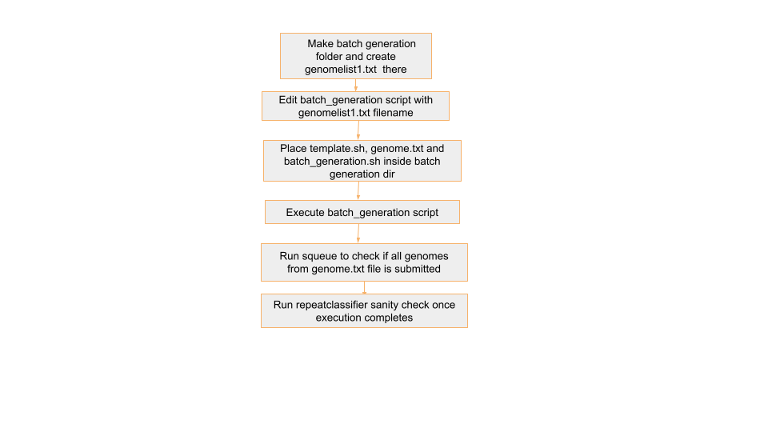

# Step 2 : RepeatClassifier

## 🔄 Automating RepeatClassifier Job Submission for Multiple Genomes
To streamline the process of running RepeatClassifier for multiple genomes, we use a loop that:

1.Reads genome names from a text file (`genomelist1.txt`)

2.Replaces a placeholder xxxx in a job template file (`template1.txt`) with the actual genome name

3.Submits the customised job file using `sbatch`

## 📁 Required Input File: `genomelist1.txt`
This file contains a list of genome names. If there's a header row, we skip it using `tail -n +2`.

Example contents:
```
genome_name
mMyoTri1.hap1.decontam
mNatMex1.HiC.hap1
mNycThe2.HiC.hap1.decontam
```

Note: The genome names `genomelist1.txt` in  should match the folder names in `/shared/input_genomes/paratus-bat/` and `/shared/input_genomes/bat1k-bat/` for Paratus and Bat1k respectively

## 📝 Job Template: `template1.txt`
This is your Slurm job script template. Wherever the text xxxx appears, it will be replaced with the genome name. Replace `/shared/input_genomes/paratus-bat/` with `/shared/input_genomes/bat1k-bat/` when processing Bat1K genomes

template script:
```
#!/bin/bash
#SBATCH --job-name=xxxx-classifier
#SBATCH --output=/shared/slurm-out/repeat_classifier_log_err/xxxx-classifier-output_job_%j.txt
#SBATCH --error=/shared/slurm-out/repeat_classifier_log_err/xxxx-classifier-error_job_%j.txt
#SBATCH --nodes=1
#SBATCH --ntasks=1
#SBATCH --cpus-per-task=48
#SBATCH --constraint=c5.12xlarge
#SBATCH --time=10:00:00
#SBATCH --chdir=/shared/input_genomes/paratus-bat/xxxx
#mkdir -p /shared/slurm-out
#chmod 777 /shared/slurm-out
echo "Running on HPC"
echo "Job started at: $(date)"
echo "Running on: $(hostname)"
echo "Working dir: $(pwd)"
echo "Listing contents:"
ls -lh
echo "Starting RepeatModeler Classifier..."
# Prevent conda from using user-specific config paths
export CONDA_PKGS_DIRS=/tmp/conda_pkgs_$SLURM_JOB_ID
export CONDA_ENVS_PATH=/tmp/conda_envs_$SLURM_JOB_ID
export HOME=/tmp  # temporary HOME to avoid ~/.condarc issue
export CONDA_NO_PLUGINS=true  # optional, if plugins are breaking it
source /shared/tools/miniconda3/etc/profile.d/conda.sh
conda activate prepare_genomes
# Get the input path
parent_dir="$(pwd)"
# Find first subdirectory (customize `head -n 1` or pattern as needed)
subdir=$(find "$parent_dir" -mindepth 1 -maxdepth 1 -type d | head -n 1)
# Define new name (customize if needed)
new_name="${parent_dir}/RepeatModeler_output"
mv "$subdir" "$new_name"
cd "${new_name}"
time /shared/masking_genomes/RepeatModeler/RepeatClassifier -consensi "${new_name}/consensi.fa" -stockholm "${new_name}/families.stk"
echo "Job completed with exit code $?"
``` 

## 🚀 Script to Generate and Submit Jobs
batch_generation.sh
```
#!/bin/bash
# Read the header and skip it
tail -n +2 genomelist1.txt | while IFS=, read genome; do
    # Replace 'xxxx' in template1.txt with $genome
    sed "s/xxxx/$genome/g" template1.txt > "${genome}_job.txt"
    sbatch "${genome}_job.txt"
done
```

## 🔍 Explanation
- The `tail -n +2` skips the first line (header) in the genome list.

- `while IFS=, read genome` reads each genome name, one at a time.

- `sed "s/xxxx/$genome/g"` replaces every instance of xxxx in `template1.txt` with the actual genome name.

- The output is saved to a new job file (e.g., `mMyoTri1_job.txt`).

- `sbatch` is then used to submit that job file to the Slurm scheduler.

## ▶️ How to Run:
- make batch generation folder like `batch_0503_classifier` inside `/shared/el-scripts/`

- Keep 20-25 genomes in `genomelist1.txt`

- keep following files in this directory : `genomelist1.txt`, `template.sh` (Replace `/shared/input_genomes/paratus-bat/` with `/shared/input_genomes/bat1k-bat/` when processing Bat1K genomes), `batch_generation.sh`

- run `./batch_generation.sh`

## 🧾 Example Output
Before running `batch_generation.sh`


After running `batch_generation.sh`


For genome `mMyoTri1`, this command creates:
```
#!/bin/bash
#SBATCH --job-name=mMyoTri1.hap1.decontam-classifier
#SBATCH --output=/shared/slurm-out/repeat_classifier_log_err/mMyoTri1.hap1.decontam-classifier-output_job_%j.txt
#SBATCH --error=/shared/slurm-out/repeat_classifier_log_err/mMyoTri1.hap1.decontam-classifier-error_job_%j.txt
#SBATCH --nodes=1
#SBATCH --ntasks=1
#SBATCH --cpus-per-task=48
#SBATCH --constraint=c5.12xlarge
#SBATCH --time=10:00:00
#SBATCH --chdir=/shared/input_genomes/paratus-bat/mMyoTri1.hap1.decontam
#mkdir -p /shared/slurm-out
#chmod 777 /shared/slurm-out
echo "Running on HPC"
echo "Job started at: $(date)"
echo "Running on: $(hostname)"
echo "Working dir: $(pwd)"
echo "Listing contents:"
ls -lh
echo "Starting RepeatModeler Classifier..."
# Prevent conda from using user-specific config paths
export CONDA_PKGS_DIRS=/tmp/conda_pkgs_$SLURM_JOB_ID
export CONDA_ENVS_PATH=/tmp/conda_envs_$SLURM_JOB_ID
export HOME=/tmp  # temporary HOME to avoid ~/.condarc issue
export CONDA_NO_PLUGINS=true  # optional, if plugins are breaking it
source /shared/tools/miniconda3/etc/profile.d/conda.sh
conda activate prepare_genomes
# Get the input path
parent_dir="$(pwd)"
# Find first subdirectory (customize `head -n 1` or pattern as needed)
subdir=$(find "$parent_dir" -mindepth 1 -maxdepth 1 -type d | head -n 1)
# Define new name (customize if needed)
new_name="${parent_dir}/RepeatModeler_output"
mv "$subdir" "$new_name"
cd "${new_name}"
time /shared/masking_genomes/RepeatModeler/RepeatClassifier -consensi "${new_name}/consensi.fa" -stockholm "${new_name}/families.stk"
echo "Job completed with exit code $?"
```

- `--output` log file:
```
#SBATCH --output=/shared/slurm-out/repeat_classifier_log_err/mMyoTri1.hap1.decontam-classifier-output_job_%j.txt
```

- `--error` error file (usually error file has all the logs):
```
#SBATCH --error=/shared/slurm-out/repeat_classifier_log_err/mMyoTri1.hap1.decontam-classifier-error_job_%j.txt
```

- `--chdir` Sets the working directory ($PWD) to the folder containing the filtered genome FASTA file for a specific genome
```
#SBATCH --chdir=/shared/input_genomes/paratus-bat/mMyoTri1.hap1.decontam
```

- **Activate conda env**
```
source /shared/tools/miniconda3/etc/profile.d/conda.sh
conda activate prepare_genomes
```

- **Find subdir that was generated by the RepeatModeler tool and rename**
```
subdir=$(find "$parent_dir" -mindepth 1 -maxdepth 1 -type d | head -n 1)
mv "$subdir" "$new_name"
cd "${new_name}"
```

- **RepeatClassifier command**
```
time /shared/masking_genomes/RepeatModeler/RepeatClassifier -consensi "${new_name}/consensi.fa" -stockholm "${new_name}/families.stk"
```
`-consensi` : path for consensi file

`-stockholm` : path for stk file

## ⏱️ Duration
Each genome job would take approximately 10min to complete

## 🔍 Sanity Checks Overview
Place the sanity check scripts in the corresponding directories based on the genome type:

- For Paratus genomes, place the scripts in `/shared/input_genomes/paratus-bat/`

- For Bat1K genomes, place the scripts in `/shared/input_genomes/bat1k-bat/`

## 🧪 RepeatClassifier Sanity Checks
repeat_classifier_check.sh
```
#!/bin/bash
# Output report file
report_file="consensi_classified_check_report.tsv"
echo -e "genome_dir\tclassified_file_present" > "$report_file"
# Loop through all top-level subdirectories
for genome_dir in */; do
    genome_name=$(basename "$genome_dir")
    rm_output_dir="${genome_dir}/RepeatModeler_output"
    target_file="${rm_output_dir}/consensi.fa.classified"
    echo "🔍 Checking $genome_name"
    if [[ -f "$target_file" ]]; then
        echo "✅ $target_file is present."
        status="present"
    else
        echo "❌ $target_file is missing."
        status="missing"
    fi
    echo -e "${genome_name}\t${status}" >> "$report_file"
    echo ""
done
echo "✅ Report written to: $report_file"
```

## ✅ What It Does:
- Iterates through each genome folder under a specified parent directory.

- Checks if `consensi.fa.classified` is present in RepeatModeler_output subdir

- Compiles the check results into a .tsv file.

## 🧾 Output .tsv File:
The script creates a tab-separated summary file with the following columns:
<div style="overflow-x: auto;">

| genome_dir                | classified_file_present |
|---------------------------|-------------------------|
| mAetAle1.hap1.cur.20250328| present                 |
</div>

Sanity_check_pass column was added manually after inspecting each row checks

## 🔁 Workflow Overview for RepeatClassifier

