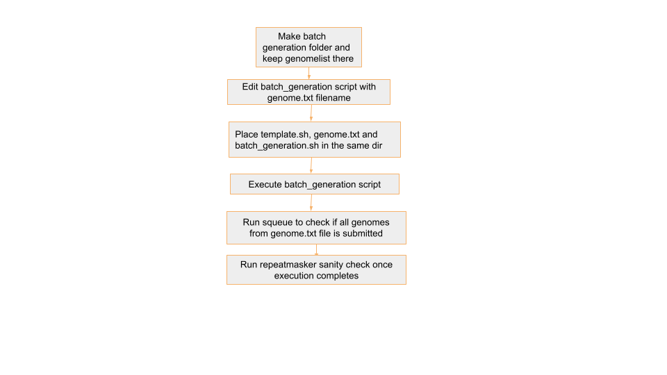

# Step 3 : RepeatMasker

## 🔄 Automating RepeatMasker Job Submission for Multiple Genomes
To streamline the process of running RepeatMasker for multiple genomes, we use a loop that:

1.Reads genome names from a text file (`genomelist1.txt`)

2.Replaces a placeholder xxxx in a job template file (`template1.txt`) with the actual genome name

3.Submits the customised job file using `sbatch`

## 📁 Required Input File: `genomelist1.txt`
This file contains a list of genome names. If there's a header row, we skip it using `tail -n +2`.

Example contents:
```
genome_name
mMyoTri1.hap1.decontam
mNatMex1.HiC.hap1
mNycThe2.HiC.hap1.decontam
```

Note: The genome names `genomelist1.txt` in  should match the directory names in `/shared/input_genomes/paratus-bat/` and `/shared/input_genomes/bat1k-bat/` for Paratus and Bat1k respectively

## 📝 Job Template: template1.txt
This is your Slurm job script template. Wherever the text xxxx appears, it will be replaced with the genome name. Replace `/shared/input_genomes/paratus-bat` in `--chdir` with
`/shared/input_genomes/bat1k-bat` when processing Bat1K genomes.

template script:
```
#!/bin/bash
#SBATCH --job-name=xxxx_masker
#SBATCH --output=/shared/slurm-out/repeat_masker_log_err/xxxx-masker-output_job_%j.txt
#SBATCH --error=/shared/slurm-out/repeat_masker_log_err/xxxx-masker-error_job_%j.txt
#SBATCH --nodes=1
#SBATCH --ntasks=1
#SBATCH --cpus-per-task=48
#SBATCH --constraint=c5.12xlarge
#SBATCH --time=50:00:00
#SBATCH --chdir=/shared/input_genomes/paratus-bat/xxxx
#mkdir -p /shared/slurm-out
#chmod 777 /shared/slurm-out
echo "Running on HPC"
echo "Job started at: $(date)"
echo "Running on: $(hostname)"
echo "Working dir: $(pwd)"
echo "Listing contents:"
ls -lh
echo "Starting RepeatModeler Masker..."
# Prevent conda from using user-specific config paths
export CONDA_PKGS_DIRS=/tmp/conda_pkgs_$SLURM_JOB_ID
export CONDA_ENVS_PATH=/tmp/conda_envs_$SLURM_JOB_ID
export HOME=/tmp # temporary HOME to avoid ~/.condarc issue
export CONDA_NO_PLUGINS=true # optional, if plugins are breaking it
source /shared/tools/miniconda3/etc/profile.d/conda.sh
conda activate prepare_genomes
# Get the input path
parent_dir="$(pwd)"
# Define new name (customize if needed)
new_name_rmodler="${parent_dir}/RepeatModeler_output"
new_name="${parent_dir}/RepeatMasker_output"
mkdir "${new_name}"
cd "${new_name}"
time /shared/masking_genomes/RepeatMasker/RepeatMasker -pa 48 -xsmall -s -lib "${new_name_rmodler}/consensi.fa.classified" "${parent_dir}/xxxx_renamed.fa"
echo "Job completed with exit code $?"
```

## 🚀 Script to Generate and Submit Jobs
batch_generation.sh
```
#!/bin/bash
# Read the header and skip it
tail -n +2 genomelist1.txt | while IFS=, read genome; do
    # Replace 'xxxx' in template1.txt with $genome
    sed "s/xxxx/$genome/g" template1.txt > "${genome}_job.txt"
    sbatch "${genome}_job.txt"
done
``` 

## 🔍 Explanation
- The `tail -n +2` skips the first line (header) in the genome list.

- `while IFS=, read genome` reads each genome name, one at a time.

- sed "s/xxxx/$genome/g" replaces every instance of xxxx in `template1.txt` with the actual genome name.

- The output is saved to a new job file (e.g., `mMyoTri1_job.txt`).

- `sbatch` is then used to submit that job file to the Slurm scheduler.

## ▶️ How to Run:
- make batch generation folder like `batch_0503_masker` inside `/shared/el-scripts/`

- Keep 15-20 genomes in `genomelist1.txt`

- keep `genomelist1.txt`, `template.sh`, `batch_generation.sh` in this folder

- run `./batch_generation.sh`

## 🧾 Example Output
Before running `batch_generation.sh`


After running `batch_generation.sh`


For genome `mMyoTri1`, this command creates:
```
#!/bin/bash
#SBATCH --job-name=mMyoTri1.hap1.decontam_masker
#SBATCH --output=/shared/slurm-out/repeat_masker_log_err/mMyoTri1.hap1.decontam-masker-output_job_%j.txt
#SBATCH --error=/shared/slurm-out/repeat_masker_log_err/mMyoTri1.hap1.decontam-masker-error_job_%j.txt
#SBATCH --nodes=1
#SBATCH --ntasks=1
#SBATCH --cpus-per-task=48
#SBATCH --constraint=c5.12xlarge
#SBATCH --time=50:00:00
#SBATCH --chdir=/shared/input_genomes/paratus-bat/mMyoTri1.hap1.decontam
#mkdir -p /shared/slurm-out
#chmod 777 /shared/slurm-out
echo "Running on HPC"
echo "Job started at: $(date)"
echo "Running on: $(hostname)"
echo "Working dir: $(pwd)"
echo "Listing contents:"
ls -lh
echo "Starting RepeatModeler Masker..."
# Prevent conda from using user-specific config paths
export CONDA_PKGS_DIRS=/tmp/conda_pkgs_$SLURM_JOB_ID
export CONDA_ENVS_PATH=/tmp/conda_envs_$SLURM_JOB_ID
export HOME=/tmp # temporary HOME to avoid ~/.condarc issue
export CONDA_NO_PLUGINS=true # optional, if plugins are breaking it
source /shared/tools/miniconda3/etc/profile.d/conda.sh
conda activate prepare_genomes
# Get the input path
parent_dir="$(pwd)"
# Define new name (customize if needed)
new_name_rmodler="${parent_dir}/RepeatModeler_output"
new_name="${parent_dir}/RepeatMasker_output"
mkdir "${new_name}"
cd "${new_name}"
time /shared/masking_genomes/RepeatMasker/RepeatMasker -pa 48 -xsmall -s -lib "${new_name_rmodler}/consensi.fa.classified" "${parent_dir}/mMyoTri1.hap1.decontam_renamed.fa"
echo "Job completed with exit code $?"
```

- `--output` log file:
```
#SBATCH --output=/shared/slurm-out/repeat_masker_log_err/mMyoTri1.hap1.decontam-masker-output_job_%j.txt
```

- `--error` error file (usually error file has all the logs):
```
#SBATCH --error=/shared/slurm-out/repeat_masker_log_err/mMyoTri1.hap1.decontam-masker-error_job_%j.txt
```
- `--chdir` Sets the working directory ($PWD) to the folder containing the filtered genome FASTA file for a specific genome

- Define output folder for RepeatMasker output new_name_rmodler="${parent_dir}/RepeatModeler_output"
```
#SBATCH --chdir=/shared/input_genomes/paratus-bat/mMyoTri1.hap1.decontam
```

- **Activate conda env**
```
source /shared/tools/miniconda3/etc/profile.d/conda.sh
conda activate prepare_genomes
```

- **Run RepeatMasker**
```
time /shared/masking_genomes/RepeatMasker/RepeatMasker -pa 48 -xsmall -s -lib "${new_name_rmodler}/consensi.fa.classified" "${parent_dir}/mMyoTri1.hap1.decontam_renamed.fa"
```

- `-pa` : Parallel execution with 48 threads (make sure to match --cpus-per-task=48 in your SBATCH header)

- `-lib` :classified file path

${parent_dir}/mMyoTri1.hap1.decontam_renamed.fa : fasta filepath

## ⏱️ Duration
Each genome job would take approximately 4hrs to complete

## 🔍 Sanity Checks Overview

Place the sanity check scripts in the corresponding directories based on the genome type:

- For Paratus genomes, place the scripts in `/shared/input_genomes/paratus-bat/`

- For Bat1K genomes, place the scripts in `/shared/input_genomes/bat1k-bat/`

repeat_masker_v3.sh
```
#!/bin/bash

# File suffixes to check
suffixes=("fa.cat.gz" "fa.masked" "fa.out")

# Report file
report_file="masking_qc_report.tsv"
echo -e "directory\tfa.cat.gz_found\tfa.masked_found\tfa.out_found\trenamed_fa_found\tsize_check_status\tsize_diff_bytes\tcase_check\tmasked_base_percent\tchromosome_check" > "$report_file"

# Loop through all subdirectories
for dir in */; do
    cd "$dir" || continue
    echo "📁 Processing $dir"

    cat_found="No"
    masked_found="No"
    out_found="No"
    renamed_found="No"
    size_check="NA"
    size_diff="NA"
    case_check="NA"
    masked_percent="NA"
    chromosome_check="NA"

    # Check for required files
    for suffix in "${suffixes[@]}"; do
        file=$(find . -maxdepth 1 -name "*.$suffix")
        if [[ -z "$file" ]]; then
            echo "❌ Missing file with suffix: .$suffix"
        else
            echo "✅ Found: $file"
            [[ "$suffix" == "fa.cat.gz" ]] && cat_found="Yes"
            [[ "$suffix" == "fa.masked" ]] && masked_found="Yes"
            [[ "$suffix" == "fa.out" ]] && out_found="Yes"
        fi
    done

    fa_masked=$(find . -maxdepth 1 -name "*.fa.masked" | head -n 1)
    renamed_fa=$(find . -maxdepth 1 -name "*_renamed.fa" | head -n 1)

    if [[ -n "$fa_masked" ]]; then masked_found="Yes"; fi
    if [[ -n "$renamed_fa" ]]; then renamed_found="Yes"; fi

    if [[ -n "$fa_masked" && -n "$renamed_fa" ]]; then
        # File size comparison (with 10MB tolerance)
        size_masked=$(stat -c%s "$fa_masked")
        size_renamed=$(stat -c%s "$renamed_fa")
        tolerance=$((10 * 1024 * 1024))
        diff=$((size_masked - size_renamed))
        diff=${diff#-}
        size_diff=$diff

        if [[ "$diff" -le "$tolerance" ]]; then
            echo "✅ File sizes are approximately equal"
            size_check="Pass"
        else
            echo "❌ File sizes differ too much"
            size_check="Fail"
        fi

        # Check for both lowercase and uppercase characters
        if grep -q '[a-z]' "$fa_masked" && grep -q '[A-Z]' "$fa_masked"; then
            echo "✅ $fa_masked contains both lowercase and uppercase bases"
            case_check="Yes"
        else
            echo "❌ $fa_masked does NOT contain both lowercase and uppercase bases"
            case_check="No"
        fi

        # Calculate masked base percentage
        masked_percent=$(awk '
        /^>/ { next }
        {
            total += length($0)
            masked += gsub(/[nN]/, "")
            masked += gsub(/[atcgn]/, "")
        }
        END {
            if (total > 0) {
                printf "%.2f", (masked / total) * 100
            } else {
                print "NA"
            }
        }' "$fa_masked")
        echo "📊 Masked base percentage: $masked_percent%"

        # Compare chromosome headers
        renamed_headers=$(grep "^>" "$renamed_fa" | sed 's/^>//' | cut -d' ' -f1 | sort -u)
        masked_headers=$(grep "^>" "$fa_masked" | sed 's/^>//' | cut -d' ' -f1 | sort -u)

        missing_chroms=()
        while read -r chrom; do
            if ! grep -q "^$chrom$" <<< "$masked_headers"; then
                missing_chroms+=("$chrom")
            fi
        done <<< "$renamed_headers"

        if [[ ${#missing_chroms[@]} -eq 0 ]]; then
            chromosome_check="All_present"
        else
            chromosome_check=$(IFS=,; echo "Missing:${missing_chroms[*]}")
        fi
        echo "🔍 Chromosome check: $chromosome_check"
    fi

    # Write to report
    echo -e "${dir%/}\t$cat_found\t$masked_found\t$out_found\t$renamed_found\t$size_check\t$size_diff\t$case_check\t$masked_percent\t$chromosome_check" >> "../$report_file"

    cd ..
done

echo "✅ QC report written to: $report_file"
```

## ✅ What It Does:

- Iterates through each genome folder within a given parent directory

- Checks for the presence of the following files in each genome directory:

  - *.fa.cat.gz

  - *.fa.masked

  - *.fa.out

- Verifies that the size difference between the original and masked FASTA files is within 10 MB

- Confirms that the masked FASTA file contains both uppercase and lowercase characters

- Calculates the percentage of bases that are masked

- Compares headers of the original and masked FASTA files to identify any missing chromosomes

- Records all check results and summaries into a .tsv report

## 🧾 Output .tsv File:

The script creates a tab-separated summary file with the following columns:

<div style="overflow-x: auto;">

| Genome Name                | fa.cat.gz_found | fa.masked_found | fa.out_found | renamed_fa_found | size_check_status | size_diff_bytes | case_check | masked_base_percent | chromosome_check |
|----------------------------|-----------------|-----------------|--------------|------------------|-------------------|-----------------|------------|----------------------|------------------|
| mCynHor1.hap1.cur.20250324 | Yes             | Yes             | Yes          | Yes              | Pass              | 5872971         | Yes        | 25.31               | All_present      |

</div>

## 🔁 Workflow Overview for RepeatMasker


