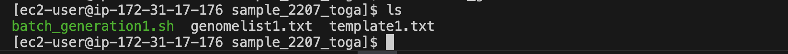
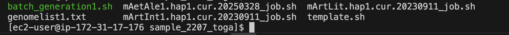
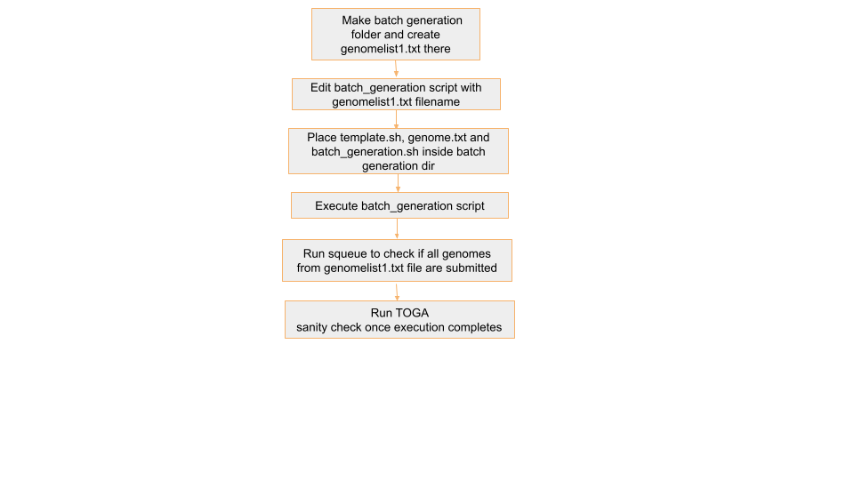
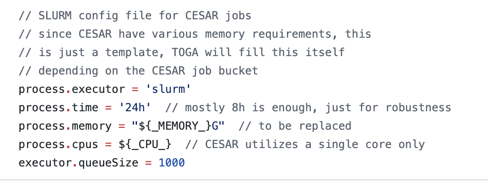
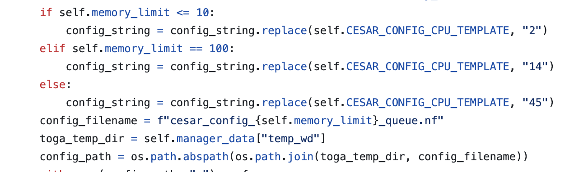

# Step 5 : TOGA
## 🔄 Automating TOGA Job Submission for Multiple Genomes
To streamline the process of running TOGA for multiple genomes, we use a loop that:

Reads genome names from a text file (`genomelist1.txt`)

Replaces a placeholder xxxx in a job template file (`template1.txt`) with the actual genome name

Submits the customised job file using `sbatch`

## 📁 Required Input File: `genomelist1.txt`
This file contains a list of genome names. If there's a header row, we skip it using `tail -n +2`.

Example contents:
```
genome_name
mMyoTri1.hap1.decontam
mNatMex1.HiC.hap1
mNycThe2.HiC.hap1.decontam
```
Note: The genome names `genomelist1.txt` in  should match the folder names in `/shared/input_genomes/paratus-bat/` and `/shared/input_genomes/bat1k-bat/` for Paratus and Bat1k respectively

## 📝 Job Template: `template1.txt` 
This is your Slurm job script template. Wherever the text xxxx appears, it will be replaced with the genome name. Replace '/shared/input_genomes/paratus-bat/' with `/shared/input_genomes/bat1k-bat/` when processing Bat1K genomes.

template script: 
```
#!/bin/bash
#SBATCH --output=/shared/slurm-out/toga/xxxx_out_%j.txt
#SBATCH --error=/shared/slurm-out/toga/xxxx_err_%j.txt
#SBATCH --job-name=xxxx_toga
#SBATCH --nodes=1
#SBATCH --ntasks=1
#SBATCH --exclusive
#SBATCH --constraint=r5.24xlarge
#SBATCH --time=100:00:00
#testing CPU update in paralle jobs manager
# Are you in the toga2 environment? 
# Did you module load gcc/9.4.0?
echo "Running on HPC"
echo "Job started at: $(date)"
echo "Running on: $(hostname)"
echo "Working dir: $(pwd)"
echo "Listing contents:"
ls -lh
echo "Testing toga genome..."
# Prevent conda from using user-specific config paths
export CONDA_PKGS_DIRS=/tmp/conda_pkgs_$SLURM_JOB_ID
export CONDA_ENVS_PATH=/tmp/conda_envs_$SLURM_JOB_ID
export HOME=/tmp  # temporary HOME to avoid ~/.condarc issue
export CONDA_NO_PLUGINS=true  # optional, if plugins are breaking it
source /shared/tools/miniconda3/etc/profile.d/conda.sh
conda activate /shared/tools/miniconda3/envs/toga
# Set species name
SPECIES=xxxx
BASE_DIR=/shared/input_genomes/human
TRACK_DIR=/shared/input_genomes/paratus-bat/xxxx/chainout_set2
git config --global --add safe.directory /shared/masking_genomes/TOGA
python /shared/masking_genomes/TOGA/toga.py \
  $TRACK_DIR/hg38.xxxx.final.chain \
  $BASE_DIR/hg38.v35.for_toga.bed \
  $BASE_DIR/hg38.2bit \
  $TRACK_DIR/query.2bit \
  --kt \
  --pn /shared/input_genomes/paratus-bat/xxxx \
  -i $BASE_DIR/hg38.v35.for_toga.isoforms.tsv \
  --nc /shared/masking_genomes/TOGA/nextflow_config_files \
  --cb 10,100,375 \
  --cjn 500 \
  --u12 $BASE_DIR/hg38.U12sites.tsv \
  --ms \
  --nd /shared/input_genomes/paratus-bat/nextflow_dir_nd_param/xxxx/
echo "Job completed with exit code $?"
echo "Script ended at: $(date)"
``` 

## 🚀 Script to Generate and Submit Jobs
batch_generation.sh
```
#!/bin/bash
# Read the header and skip it
tail -n +2 genomelist1.txt | while IFS=, read genome; do
    # Replace 'xxxx' in template1.txt with $genome
    sed "s/xxxx/$genome/g" template1.txt > "${genome}_job.txt"
    sbatch "${genome}_job.txt"
done
``` 

## 🔍 Explanation
The `tail -n +2` skips the first line (header) in the genome list.

`while IFS=, read genome` reads each genome name, one at a time.

`sed "s/xxxx/$genome/g"` replaces every instance of xxxx in `template1.txt` with the actual genome name.

The output is saved to a new job file (e.g., `mMyoTri1_job.txt`).

`sbatch` is then used to submit that job file to the Slurm scheduler.

## ▶️ How to Run:
- make batch generation folder like `batch_0503_toga` inside `/shared/el-scripts/`

- Keep 3-4 genomes in `genomelist1.txt`

- keep `genomelist1.txt`, `template.sh` (Replace '/shared/input_genomes/paratus-bat/' with `/shared/input_genomes/bat1k-bat/` when processing Bat1K genomes) ,`batch_generation.sh` in this folder

- run `./batch_generation.sh`

## 🧾 Example Output
Before running `batch_generation.sh`


After running `batch_generation.sh`


For genome `mGloMut1.hap1.cur.20231205`, this command creates:
```
#!/bin/bash
#SBATCH --output=/shared/slurm-out/mGloMut1.hap1.cur.20231205_out_%j.txt
#SBATCH --error=/shared/slurm-out/mGloMut1.hap1.cur.20231205_err_%j.txt
#SBATCH --job-name=mGloMut1.hap1.cur.20231205_toga
#SBATCH --nodes=1
#SBATCH --ntasks=1
#SBATCH --exclusive
#SBATCH --constraint=r5.24xlarge
#SBATCH --time=100:00:00
#testing CPU update in paralle jobs manager
# Are you in the toga2 environment? 
# Did you module load gcc/9.4.0?
echo "Running on HPC"
echo "Job started at: $(date)"
echo "Running on: $(hostname)"
echo "Working dir: $(pwd)"
echo "Listing contents:"
ls -lh
echo "Testing toga genome..."
# Prevent conda from using user-specific config paths
export CONDA_PKGS_DIRS=/tmp/conda_pkgs_$SLURM_JOB_ID
export CONDA_ENVS_PATH=/tmp/conda_envs_$SLURM_JOB_ID
export HOME=/tmp  # temporary HOME to avoid ~/.condarc issue
export CONDA_NO_PLUGINS=true  # optional, if plugins are breaking it
source /shared/tools/miniconda3/etc/profile.d/conda.sh
conda activate /shared/tools/miniconda3/envs/toga
# Set species name
SPECIES=mGloMut1.hap1.cur.20231205
BASE_DIR=/shared/input_genomes/human
TRACK_DIR=/shared/input_genomes/paratus-bat/mGloMut1.hap1.cur.20231205/chainout_set2
git config --global --add safe.directory /shared/masking_genomes/TOGA
python /shared/masking_genomes/TOGA/toga.py \
  $TRACK_DIR/hg38.mGloMut1.hap1.cur.20231205.final.chain \
  $BASE_DIR/hg38.v35.for_toga.bed \
  $BASE_DIR/hg38.2bit \
  $TRACK_DIR/query.2bit \
  --kt \
  --pn /shared/input_genomes/paratus-bat/mGloMut1.hap1.cur.20231205 \
  -i $BASE_DIR/hg38.v35.for_toga.isoforms.tsv \
  --nc /shared/masking_genomes/TOGA/nextflow_config_files \
  --cb 10,100,375 \
  --cjn 500 \
  --u12 $BASE_DIR/hg38.U12sites.tsv \
  --ms \
  --nd /shared/input_genomes/paratus-bat/nextflow_dir_nd_param/mGloMut1.hap1.cur.20231205/
echo "Job completed with exit code $?"
echo "Script ended at: $(date)"
```
- `--output` log file:
```
#SBATCH --output=/shared/slurm-out/mGloMut1.hap1.cur.20231205_out_%j.txt
```
- `--error` error file (usually error file has all the logs):
```
#SBATCH --error=/shared/slurm-out/mGloMut1.hap1.cur.20231205_err_%j.txt
```
- **Activates conda env**
```
source /shared/tools/miniconda3/etc/profile.d/conda.sh
conda activate /shared/tools/miniconda3/envs/toga
```
- **Defines genome name**
```
SPECIES=mGloMut1.hap1.cur.20231205
```
- **Defines make_lastz output folder**
```
TRACK_DIR=/shared/input_genomes/paratus-bat/mGloMut1.hap1.cur.20231205/chainout_set2
```
- **Run TOGA command**
```
python /shared/masking_genomes/TOGA/toga.py \
  $TRACK_DIR/hg38.mGloMut1.hap1.cur.20231205.final.chain \
  $BASE_DIR/hg38.v35.for_toga.bed \
  $BASE_DIR/hg38.2bit \
  $TRACK_DIR/query.2bit \
  --kt \
  --pn /shared/input_genomes/paratus-bat/mGloMut1.hap1.cur.20231205 \
  -i $BASE_DIR/hg38.v35.for_toga.isoforms.tsv \
  --nc /shared/masking_genomes/TOGA/nextflow_config_files \
  --cb 10,100,375 \
  --cjn 500 \
  --u12 $BASE_DIR/hg38.U12sites.tsv \
  --ms \
  --nd /shared/input_genomes/paratus-bat/nextflow_dir_nd_param/mGloMut1.hap1.cur.20231205/
```
`chain filepath` : $TRACK_DIR/hg38.mGloMut1.hap1.cur.20231205.final.chain

`toga bed filepath` : $BASE_DIR/hg38.v35.for_toga.bed

`target 2bit filepath` : $BASE_DIR/hg38.2bit

`query 2bit filepath` : $TRACK_DIR/query.2bit

`--kt` : keep temp dir

`--pn` : output folder path

`--nc` : nextflow config filepath

`--cb` : cb bucket values

`--cjn` : cesar job number

`--u12` : U12sites.tsv filepath

`--nd` : nextflow dir

## ⏱️ Duration
Each genome job would take approximately ~6hrs to complete

 
## 🔍 Sanity Checks Overview
Place the sanity check scripts in the corresponding directories based on the genome type:

For Paratus genomes, place the scripts in `/shared/input_genomes/paratus-bat/`

For Bat1K genomes, place the scripts in `/shared/input_genomes/bat1k-bat/`

## 🧪 TOGA Sanity Checks
```
#!/bin/bash
genomes_root="/shared/input_genomes/paratus-bat"
output_summary="intact_gene_summary.csv"
# Write header to the CSV file
echo "genome_name,intact_gene_count,equal_file_count,all_non_empty,cesar_fail_count" > "$output_summary"
# Loop through each genome directory
for genome_dir in "$genomes_root"/*/; do
    genome_name=$(basename "$genome_dir")
    temp_folder="${genome_dir}/temp"
    cesar_results="${temp_folder}/cesar_results"
    cesar_jobs="${temp_folder}/cesar_jobs"
    echo "🔍 Checking genome: $genome_name"
    equal_file_count="no"
    all_non_empty="no"
    intact_count="NA"
    cesar_fail_count="NA"
    # Check if both directories exist
    if [[ -d "$cesar_results" && -d "$cesar_jobs" ]]; then
        num_results=$(ls -1 "$cesar_results" | wc -l)
        num_jobs=$(ls -1 "$cesar_jobs" | wc -l)
        if [[ $num_results -eq $num_jobs ]]; then
            echo "✅ [$genome_name] cesar_results and cesar_jobs have equal number of files: $num_results"
            equal_file_count="yes"
            # Check for non-empty files in cesar_results
            empty_count=$(find "$cesar_results" -type f -empty | wc -l)
            if [[ $empty_count -eq 0 ]]; then
                echo "✅ [$genome_name] All files in cesar_results are non-empty"
                all_non_empty="yes"
            else
                echo "❌ [$genome_name] $empty_count empty files found in cesar_results"
            fi
        else
            echo "❌ [$genome_name] File count mismatch: cesar_results=$num_results, cesar_jobs=$num_jobs"
        fi
    else
        echo "⚠️  [$genome_name] One or both required directories do not exist"
    fi
    # Check and count intact genes from loss_summ_data.tsv
    loss_file="${genome_dir}/loss_summ_data.tsv"
    intact_file="${genome_dir}/howmany_intact_genes.txt"
    if [[ -f "$loss_file" ]]; then
        awk -F'\t' '$1 == "GENE" && $3 == "I"' "$loss_file" > "$intact_file"
        intact_count=$(wc -l < "$intact_file")
        echo "🧬 [$genome_name] Intact genes: $intact_count"
    else
        echo "⚠️  [$genome_name] loss_summ_data.tsv not found"
    fi
    # Check for CESAR crashed jobs
    crash_file="${temp_folder}/_cesar_crashed_jobs.txt"
    if [[ -f "$crash_file" ]]; then
        cesar_fail_count=$(grep -c '^' "$crash_file")
        echo "💥 [$genome_name] CESAR failed commands: $cesar_fail_count"
    else
        cesar_fail_count=0
        echo "✅ [$genome_name] No CESAR failed commands"
    fi
    # Append results to the summary CSV
    echo "${genome_name},${intact_count},${equal_file_count},${all_non_empty},${cesar_fail_count}" >> "$output_summary"
    echo "-----------------------------------------------------"
done
```

## ✅ What It Does:
- Iterates through each genome folder within a specified directory

- Verifies that the number of files in `temp/cesar_results` matches those in `temp/cesar_jobs` (to ensure all CESAR jobs were initiated)

- Checks that all files in `temp/cesar_results` are non-empty (to detect any crashed CESAR jobs)

- Extracts the number of intact genes from `loss_summ_data.tsv`

- Counts the number of crashed CESAR jobs from `temp/_cesar_crashed_jobs.txt`

- Summarizes all checks in a .tsv output file

## 🧾 Output .tsv File:
The script creates a tab-separated summary file with the following columns:
<div style="overflow-x: auto;">

| genome_name               | intact_gene_count | equal_file_count | all_non_empty | cesar_fail_count |
|---------------------------|-------------------|------------------|---------------|------------------|
| mArtInt1.hap1.cur.20230911| 16356             | yes              | yes           | 8                |
| mArtLit.hap1.cur.20230911 | 16433             | yes              | yes           | 4                |
</div>

## 🔁 Workflow Overview for TOGA



## 🧬 TOGA Orchestration
## 🧠 Efficient Genome Processing with TOGA Using Only ~35 Nodes
We were able to process a genome using TOGA with `cjn = 500` while utilizing only **~35 compute nodes on average**, significantly reducing the expected resource usage.

## 🚨 The Problem
TOGA submits CESAR jobs for each memory bucket (**10 GB**, **100 GB**, **375 GB**) using a config file, which is dynamically updated to reflect the memory required for that job type. This config file communicates with the **Slurm orchestrator** to request the appropriate amount of memory per job.

However, in practice, **Slurm does not strictly enforce memory isolation across jobs**. Even when CESAR jobs requested the correct amount of RAM, Slurm could still pack **multiple jobs onto a single node**, ignoring the cumulative memory demand.

As a result, job scheduling often led to **oversubscription of memory**. For example:

- On an `r5.24xlarge` node (768 GiB RAM), multiple 375 GB CESAR jobs were scheduled together, even though only **two** such jobs should fit (`2 × 375 = 750 GiB < 768 GiB`).

- Similar memory contention occurred with **10 GB** and **100 GB** jobs.

These oversubscription issues caused:

- **Out-of-memory (OOM) errors**

- **Forced job terminations**

- **Wasted compute cycles and retries**

## 🧪 Attempted Fix: Node Exclusivity
To resolve the memory contention, we first tried **node exclusivity**, allowing only **one job per node**. While this prevented oversubscription, it introduced a critical bottleneck:

Running `cjn = 500` would require **500 nodes**

The cluster has a hard limit of **250 nodes**

Therefore, this approach was **not scalable**

## ✅ Final Solution: CPU-Constrained Job Allocation
We identified that **RAM allocation alone does not dictate how many jobs Slurm places on a node** instead, the **number of CPUs requested per job significantly influences scheduling behavior.**

Using this insight, we updated TOGA’s job submission configuration to:

- **Assign CPUs proportional to memory needs**

- **Enforce this through** `process.cpus` **in the config** (refer code updates section call_cesar_config_template.nf)

- **Dynamically control CPU values via TOGA’s parallel job manager** (refer code updates section parallel_jobs_manager.py )

This ensured that CPU requests indirectly enforced memory constraints, limiting how many jobs Slurm could place on a node and avoiding oversubscription.

All machines in the high-memory cluster follow a **uniform CPU-to-RAM ratio of 96 CPUs : 768 GiB RAM,** i.e., **1 CPU per 8 GiB RAM.**
This made it straightforward to translate memory needs into CPU allocations:

- 10 GB job → 2 CPUs → reserves ~16 GiB

- 100 GB job → 14 CPUs → reserves ~112 GiB

- 375 GB job → 45 CPUs → reserves ~360 GiB

We observed that when cjn is 500, there are usually ~381 jobs in 10gb bucket, ~129 jobs in 100gb bucket, ~6 jobs in 375gb bucket

## 🧮 CESAR Job Resource Allocation Summary

| Job Type | Job Count | Memory Needed per Job | CPUs Assigned | Implied Memory (1 CPU = 8 GiB) | Jobs per Node (96 CPUs) | Estimated Nodes |
|----------|-----------|-----------------------|---------------|--------------------------------|-------------------------|-----------------|
| 10 GB    | 381       | ~10 GiB              | 2 CPUs        | 16 GiB                         | 48 jobs                 | ≈ 8 nodes       |
| 100 GB   | 129       | ~100 GiB             | 14 CPUs       | 112 GiB                        | 6–7 jobs                | ≈ 22 nodes      |
| 375 GB   | 6         | ~375 GiB             | 45 CPUs       | 360 GiB                        | 2 jobs                  | 3 nodes         |


## 📦 Final Resource Usage
- **381 10 GB jobs** → ~8 nodes

- **129 100 GB jobs** → ~22 nodes

- **6 375 GB jobs** → 3 nodes
→ **Total: ~33 nodes**

This dynamic CPU allocation approach brought the job count **well within the cluster’s node limit**, while fully utilising both CPU and memory resources on each machine.

## Code Updates
- Scripts uploaded to https://github.com/paratusbio/Positive-selection/tree/el-scripts/UPDATED_TOGA_scripts

- Updated `process.cpus = 1` to use a placeholder: `process.cpus = ${_CPU_}` call_cesar_config_template.nf
 

- Updated parallel_jobs_manager.py to dynamically set the CPU value in `call_cesar_config_template.nf` based on the cb bucket, replacing the placeholder accordingly.


- We also added `#SBATCH --exclusive` to the SLURM job script to ensure that each TOGA head job was assigned an entire node exclusively.


