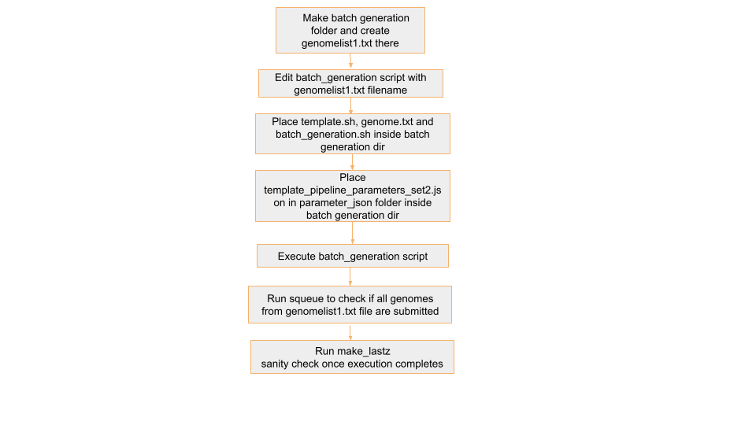

## Step 4 : Make_Lastz_chains

## 🧾 🔄 Automating Make_Lastz_chains Job Submission for Multiple Genomes

To streamline the process of running Make_lastz_chains for multiple genomes, we use a loop that:

1.Reads genome names from a text file (`genomelist1.txt`)

2.Replaces a placeholder xxxx in a job template file (`template1.txt`) with the actual genome name

3.Submits the customised job file using `sbatch`

## 📁 Required Input File: `genomelist1.txt`

This file contains a list of genome names. If there's a header row, we skip it using `tail -n +2`.

Example contents:
```
genome_name
mMyoTri1.hap1.decontam
mNatMex1.HiC.hap1
mNycThe2.HiC.hap1.decontam
```
Note: The genome names `genomelist1.txt` in  should match the folder names in `/shared/input_genomes/paratus-bat/` and `/shared/input_genomes/bat1k-bat/` for Paratus and Bat1k respectively

## 📝 Job Template: `template1.txt`

This is your Slurm job script template. Wherever the text xxxx appears, it will be replaced with the genome name. Replace `/shared/input_genomes/bat1k-bat/` with 
`/shared/input_genomes/paratus-bat/` in `--chdir` when processing paratus genomes

template script:
```
#!/bin/bash
#SBATCH --job-name=xxxx_makechains
#SBATCH --output=/shared/slurm-out/make_lastz_chains/xxxx_out_%j.txt
#SBATCH --error=/shared/slurm-out/make_lastz_chains/xxxx_err_%j.txt
#SBATCH --nodes=1
#SBATCH --ntasks=1
#SBATCH --cpus-per-task=72
#SBATCH --constraint=c5.18xlarge
#SBATCH --time=72:00:00
#SBATCH --chdir=/shared/input_genomes/bat1k-bat/xxxx

#mkdir -p /shared/slurm-out
#chmod 777 /shared/slurm-out

echo "Script started at: $(date)"

echo "Running on HPC"
echo "Job started at: $(date)"
echo "Running on: $(hostname)"
echo "Working dir: $(pwd)"
echo "Listing contents:"
ls -lh

echo "Testing make_lastz_chains..."


# Prevent conda from using user-specific config paths
export CONDA_PKGS_DIRS=/tmp/conda_pkgs_$SLURM_JOB_ID
export CONDA_ENVS_PATH=/tmp/conda_envs_$SLURM_JOB_ID
export HOME=/tmp  # temporary HOME to avoid ~/.condarc issue
export CONDA_NO_PLUGINS=true  # optional, if plugins are breaking it

source /shared/tools/miniconda3/etc/profile.d/conda.sh

conda activate chaining

/shared/input_genomes/human/rename_chromosomes.sh xxxx_renamed.fa.masked xxxx_renamed_mlc.fa.masked

/shared/masking_genomes/ucsc_tools_static/faSize xxxx_renamed_mlc.fa.masked xxxx.chromsize

##not using --seq1_limit 30 --seq2_limit 2000

rm -rf /shared/input_genomes/bat1k-bat/xxxx/chainout_set2

/shared/masking_genomes/make_lastz_chains/make_chains.py hg38 xxxx /shared/input_genomes/human/hg38_renamed.fa \
                        /shared/input_genomes/bat1k-bat/xxxx/xxxx_renamed_mlc.fa.masked \
                        --pd /shared/input_genomes/bat1k-bat/xxxx/chainout_set2 \
                        --params_from_file /shared/el-scripts/mlc_paratus_batch_0516/parameter_json/xxxx_pipeline_parameters_set2.json \
                        -f --executor slurm


echo "Job completed with exit code $?"

echo "Script ended at: $(date)"
```

template_pipeline_parameters_set2.json

```
{
    "target_name": "hg38", 
    "query_name": "xxxx", 
    "project_dir": "chainout", 
    "continue_from_step": null, 
    "cluster_executor": "slurm", 
    "cluster_queue": "compute-queue", 
    "params_from_file": "/shared/el-scripts/mlc_paratus_batch_0516/parameter_json/xxxx_pipeline_parameters_set2.json",
    "seq_1_dir": "/shared/input_genomes/human/hg38.2bit",
    "seq_1_len": "/shared/input_genomes/human/hg38.chrom.sizes",
    "seq_2_dir": "/shared/input_genomes/bat1k-bat/xxxx/xxxx.2bit",
    "seq_2_len": "/shared/input_genomes/bat1k-bat/xxxx/xxxx.chromsize",
    "lastz_y": 9400,
    "lastz_h": 2000, 
    "lastz_l": 3000, 
    "lastz_k": 2400, 
    "seq_1_chunk": 175000000, 
    "seq_1_lap": 0, 
    "seq_1_limit": 5000,
    "seq_2_chunk": 50000000, 
    "seq_2_lap": 10000, 
    "seq_2_limit": 10000, 
    "chain_min_score": 1000, 
    "chain_linear_gap": "medium", 
    "fill_chain": true,
    "fill_unmask": true,
    "fill_chain_min_score": 25000,
    "fill_insert_chain_min_score": 5000, 
    "fill_gap_max_size_t": 20000, 
    "fill_gap_max_size_q": 20000, 
    "fill_gap_min_size_t": 30, 
    "fill_gap_min_size_q": 30, 
    "fill_lastz_k": 2000,
    "fill_lastz_l": 3000, 
    "fill_memory": 16,
    "fill_prepare_memory": 50,
    "num_fill_jobs": 1000,
    "clean_chain": true,
    "chaining_memory": 16,
    "chain_clean_memory": 100,
    "clean_chain_parameters": "-LRfoldThreshold=2.5 -doPairs -LRfoldThresholdPairs=10 -maxPairDistance=10000 -maxSuspectScore=100000 -minBrokenChainScore=75000",
    "job_time_req": "48h", 
    "keep_temp": true 
}
```
## 🚀 Script to Generate and Submit Jobs

batch_generation.sh

```
#!/bin/bash

# Read the header and skip it
tail -n +2 genomelist12.txt | while IFS=, read genome; do
    # Replace 'xxxx' in template_pipeline_parameters_set2.json with $genome
    sed "s/xxxx/$genome/g" ./parameter_json/template_pipeline_parameters_set2.json > "./parameter_json/${genome}_pipeline_parameters_set2.json"
done

# Read the header and skip it
tail -n +2 genomelist12.txt | while IFS=, read genome; do
    # Replace 'xxxx' in template.sh with $genome
    sed "s/xxxx/$genome/g" template.sh > "${genome}_job.sh"
    sbatch "${genome}_job.sh"
done
```

## 🔍 Explanation

- The `tail -n +2` skips the first line (header) in the genome list.

- `while IFS=, read genome` reads each genome name, one at a time.

- `sed "s/xxxx/$genome/g"` replaces every instance of xxxx in template1.txt with the actual genome name.

- The output is saved to a new job file (e.g., `mMyoTri1_job.txt`).

- `sbatch` is then used to submit that job file to the Slurm scheduler.

## ▶️ How to Run:

- make batch generation folder like `batch_0503_make_lastz_chains` inside `/shared/el-scripts/`

- Keep 4-5 genomes in `genomelist1.txt`

- keep `genomelist1.txt`, `template.sh`(Replace /shared/input_genomes/bat1k-bat/ with /shared/input_genomes/paratus-bat/ in --chdir when processing paratus genomes) ,`batch_generation.sh` in this folder

- run `./batch_generation.sh`

## 🧾 Example Output
Before running `batch_generation.sh`


After running `batch_generation.sh`


For genome `mMyoTri1`, this command creates:
- `mMyoTri1_job.txt` with:
```
#!/bin/bash
#SBATCH --job-name=mMyoTri1.hap1.decontam_makechains
#SBATCH --output=/shared/slurm-out/make_lastz_chains/mMyoTri1.hap1.decontam_out_%j.txt
#SBATCH --error=/shared/slurm-out/make_lastz_chains/mMyoTri1.hap1.decontam_err_%j.txt
#SBATCH --nodes=1
#SBATCH --ntasks=1
#SBATCH --cpus-per-task=72
#SBATCH --constraint=c5.18xlarge
#SBATCH --time=72:00:00
#SBATCH --chdir=/shared/input_genomes/paratus-bat/mMyoTri1.hap1.decontam

#mkdir -p /shared/slurm-out
#chmod 777 /shared/slurm-out

echo "Script started at: $(date)"

echo "Running on HPC"
echo "Job started at: $(date)"
echo "Running on: $(hostname)"
echo "Working dir: $(pwd)"
echo "Listing contents:"
ls -lh

echo "Testing make_lastz_chains..."


# Prevent conda from using user-specific config paths
export CONDA_PKGS_DIRS=/tmp/conda_pkgs_$SLURM_JOB_ID
export CONDA_ENVS_PATH=/tmp/conda_envs_$SLURM_JOB_ID
export HOME=/tmp  # temporary HOME to avoid ~/.condarc issue
export CONDA_NO_PLUGINS=true  # optional, if plugins are breaking it

source /shared/tools/miniconda3/etc/profile.d/conda.sh

conda activate chaining

/shared/input_genomes/human/rename_chromosomes.sh mMyoTri1.hap1.decontam_renamed.fa.masked mMyoTri1.hap1.decontam_renamed_mlc.fa.masked

/shared/masking_genomes/ucsc_tools_static/faSize mMyoTri1.hap1.decontam_renamed_mlc.fa.masked mMyoTri1.hap1.decontam.chromsize

##not using --seq1_limit 30 --seq2_limit 2000

rm -rf /shared/input_genomes/paratus-bat/mMyoTri1.hap1.decontam/chainout_set2

/shared/masking_genomes/make_lastz_chains/make_chains.py hg38 mMyoTri1.hap1.decontam /shared/input_genomes/human/hg38_renamed.fa \
                        /shared/input_genomes/paratus-bat/mMyoTri1.hap1.decontam/mMyoTri1.hap1.decontam_renamed_mlc.fa.masked \
                        --pd /shared/input_genomes/paratus-bat/mMyoTri1.hap1.decontam/chainout_set2 \
                        --params_from_file /shared/el-scripts/mlc_paratus_batch_0512/parameter_json/mMyoTri1.hap1.decontam_pipeline_parameters_set2.json \
                        -f --executor slurm


echo "Job completed with exit code $?"

echo "Script ended at: $(date)"
```
- `--output` log file:
```
#SBATCH --output=/shared/slurm-out/make_lastz_chains/mMyoTri1.hap1.decontam_out_%j.txt
```
- `--error` error file (usually error file has all the logs):
```
#SBATCH --error=/shared/slurm-out/make_lastz_chains/mMyoTri1.hap1.decontam_err_%j.txt
```
- `--chdir` Sets the working directory ($PWD) to the folder containing the filtered genome FASTA file for a specific genome
```
#SBATCH --chdir=/shared/input_genomes/paratus-bat/mMyoTri1.hap1.decontam
```
- **Activate conda env**
```
source /shared/tools/miniconda3/etc/profile.d/conda.sh
conda activate chaining
```

- **Remove special characters**
```
/shared/input_genomes/human/rename_chromosomes.sh mMyoTri1.hap1.decontam_renamed.fa.masked mMyoTri1.hap1.decontam_renamed_mlc.fa.masked
```

- **Create chromsize file**
```
/shared/masking_genomes/ucsc_tools_static/faSize mMyoTri1.hap1.decontam_renamed_mlc.fa.masked mMyoTri1.hap1.decontam.chromsize
```

- **Run chain command**
```
/shared/masking_genomes/make_lastz_chains/make_chains.py hg38 mMyoTri1.hap1.decontam /shared/input_genomes/human/hg38_renamed.fa \
                        /shared/input_genomes/paratus-bat/mMyoTri1.hap1.decontam/mMyoTri1.hap1.decontam_renamed_mlc.fa.masked \
                        --pd /shared/input_genomes/paratus-bat/mMyoTri1.hap1.decontam/chainout_set2 \
                        --params_from_file /shared/el-scripts/mlc_paratus_batch_0512/parameter_json/mMyoTri1.hap1.decontam_pipeline_parameters_set2.json \
                        -f --executor slurm
```

`target_name` : `hg38`

`query_name` : `mMyoTri1.hap1.decontam`

`target_fasta` : `/shared/input_genomes/human/hg38_renamed.fa`

`query_fasta`:  `/shared/input_genomes/paratus-bat/mMyoTri1.hap1.decontam/mMyoTri1.hap1.decontam_renamed_mlc.fa.masked`

`--pd` : output folder

 `/shared/input_genomes/paratus-bat/mMyoTri1.hap1.decontam/chainout_set2`

`--params_from_file` : `/shared/el-scripts/mlc_paratus_batch_0512/parameter_json/mMyoTri1.hap1.decontam_pipeline_parameters_set2.json`
mMyoTri1.hap1.decontam_pipeline_parameters_set2.json

```
{
    "target_name": "hg38", 
    "query_name": "mMyoTri1.hap1.decontam", 
    "project_dir": "chainout", 
    "continue_from_step": null, 
    "cluster_executor": "slurm", 
    "cluster_queue": "compute-queue", 
    "params_from_file": "/shared/el-scripts/mlc_paratus_batch_0512/parameter_json/mMyoTri1.hap1.decontam_pipeline_parameters_set2.json",
    "seq_1_dir": "/shared/input_genomes/human/hg38.2bit",
    "seq_1_len": "/shared/input_genomes/human/hg38.chrom.sizes",
    "seq_2_dir": "/shared/input_genomes/paratus-bat/mMyoTri1.hap1.decontam/mMyoTri1.hap1.decontam.2bit",
    "seq_2_len": "/shared/input_genomes/paratus-bat/mMyoTri1.hap1.decontam/mMyoTri1.hap1.decontam.chromsize",
    "lastz_y": 9400,
    "lastz_h": 2000, 
    "lastz_l": 3000, 
    "lastz_k": 2400, 
    "seq_1_chunk": 175000000, 
    "seq_1_lap": 0, 
    "seq_1_limit": 5000,
    "seq_2_chunk": 50000000, 
    "seq_2_lap": 10000, 
    "seq_2_limit": 10000, 
    "chain_min_score": 1000, 
    "chain_linear_gap": "medium", 
    "fill_chain": true,
    "fill_unmask": true,
    "fill_chain_min_score": 25000,
    "fill_insert_chain_min_score": 5000, 
    "fill_gap_max_size_t": 20000, 
    "fill_gap_max_size_q": 20000, 
    "fill_gap_min_size_t": 30, 
    "fill_gap_min_size_q": 30, 
    "fill_lastz_k": 2000,
    "fill_lastz_l": 3000, 
    "fill_memory": 16,
    "fill_prepare_memory": 50,
    "num_fill_jobs": 1000,
    "clean_chain": true,
    "chaining_memory": 16,
    "chain_clean_memory": 100,
    "clean_chain_parameters": "-LRfoldThreshold=2.5 -doPairs -LRfoldThresholdPairs=10 -maxPairDistance=10000 -maxSuspectScore=100000 -minBrokenChainScore=75000",
    "job_time_req": "48h", 
    "keep_temp": true 
}
```
## ⏱️ Duration

- Each genome job would take approximately 8-10hrs to complete

## 🔍 Sanity Checks Overview

Place the sanity check scripts in the corresponding directories based on the genome type:

- For Paratus genomes, place the scripts in `/shared/input_genomes/paratus-bat/`

- For Bat1K genomes, place the scripts in `/shared/input_genomes/bat1k-bat/`

make_lastz_v2.sh

```
#!/bin/bash

genomes_root="/shared/input_genomes/paratus-bat"
output_tsv="chain_jobs_status_summary_paratusshared.tsv"

# Write TSV header
echo -e "genome_name\tno_chain_jobs\tjob_count_check\tfinal_chain_exists\tfinal_chain_size_MB\tbefore_cleaning_chain_exists\tbefore_cleaning_chain_size_MB\tsize_difference_MB\tdiff_lt_1MB\tall_chain_exists_if_no_before" > "$output_tsv"

# Loop through each genome directory
for genome_dir in "$genomes_root"/*/; do
    genome_name=$(basename "$genome_dir")
    log_file="${genome_dir}/chainout_set2/run.log"

    # Extract number of LASTZ jobs
    if [[ -f "$log_file" ]]; then
        jobs=$(grep -oP 'LASTZ: saved \K[0-9]+' "$log_file")
        jobs=${jobs:-0}
    else
        jobs=0
    fi

    # Check job count logic
    if { [[ "$jobs" -ge 1000 && "$jobs" -le 4000 ]] || [[ "$jobs" -le 150000 ]]; }; then
        job_check="yes"
    else
        job_check="no"
    fi

    # Search for *.final.chain.gz
    final_file=$(find "${genome_dir}/chainout_set2" -maxdepth 1 -type f -name "*.final.chain.gz" 2>/dev/null | head -n 1)
    if [[ -n "$final_file" ]]; then
        final_status="yes"
        final_size_bytes=$(stat -c%s "$final_file")
    else
        final_status="no"
        final_size_bytes=0
    fi

    # Search for *.before_cleaning.chain.gz
    before_file=$(find "${genome_dir}/chainout_set2/temp_chain_run" -maxdepth 1 -type f -name "*.before_cleaning.chain.gz" 2>/dev/null | head -n 1)
    if [[ -n "$before_file" ]]; then
        before_status="yes"
        before_size_bytes=$(stat -c%s "$before_file")
    else
        before_status="no"
        before_size_bytes=0
    fi

    # Check if all.chain.gz exists when before_cleaning is missing
    if [[ "$before_status" == "no" ]]; then
        all_chain_file=$(find "${genome_dir}/chainout_set2/temp_chain_run" -maxdepth 1 -type f -name "all.chain.gz" 2>/dev/null | head -n 1)
        if [[ -n "$all_chain_file" ]]; then
            all_chain_fallback="yes"
        else
            all_chain_fallback="no"
        fi
    else
        all_chain_fallback="n/a"
    fi

    # Compute absolute size difference in bytes, then convert to MB
    size_diff_bytes=$((final_size_bytes - before_size_bytes))
    size_diff_bytes=${size_diff_bytes#-}

    final_size_MB=$(awk "BEGIN {printf \"%.2f\", $final_size_bytes/1048576}")
    before_size_MB=$(awk "BEGIN {printf \"%.2f\", $before_size_bytes/1048576}")
    size_diff_MB=$(awk "BEGIN {printf \"%.2f\", $size_diff_bytes/1048576}")

    # Check if size difference is under 1MB
    diff_check=$(awk "BEGIN {print ($size_diff_bytes < 1048576) ? \"yes\" : \"no\"}")

    # Output to TSV
    echo -e "${genome_name}\t${jobs}\t${job_check}\t${final_status}\t${final_size_MB}\t${before_status}\t${before_size_MB}\t${size_diff_MB}\t${diff_check}\t${all_chain_fallback}" >> "$output_tsv"
done
```

## ✅ What It Does:

- Iterates through each genome folder within a specified directory

- Extracts the number of LASTZ jobs submitted from the run.log file

- Verifies that the job count is between 1,000–4,000 and less than 150,000

- Checks for the presence of:

  - *.final.chain.gz

  - *.before_cleaning.chain.gz

  - If before_cleaning is missing, checks for *.all.chain.gz instead

- Compares the sizes of final.chain.gz and before_cleaning.chain.gz (or all.chain.gz)

  - Ensures the size difference does not exceed 1 MB

- Saves all check results in a .tsv summary file

## 🧾 Output `.tsv` File:
The script creates a tab-separated summary file with the following columns:
<div style="overflow-x: auto;">

| genome_name               | no_chain_jobs | job_count_check | final_chain_exists | final_chain_size_MB | before_cleaning_chain_exists | before_cleaning_chain_size_MB | size_difference_MB | diff_lt_1MB | all_chain_exists_if_no_before |
|---------------------------|---------------|-----------------|--------------------|---------------------|-----------------------------|------------------------------|-------------------|-------------|-------------------------------|
| mAetAle1                  | 0             | yes             | no                 | 0.00                | no                          | 0.00                         | 0.00              | yes         | no                            |
| mAetAle1.hap1.cur.20250328|               |                 |                    |                     |                              |                              |                   |             |                               |

</div>

## 🔁 Workflow Overview for make_Lastz_chains

